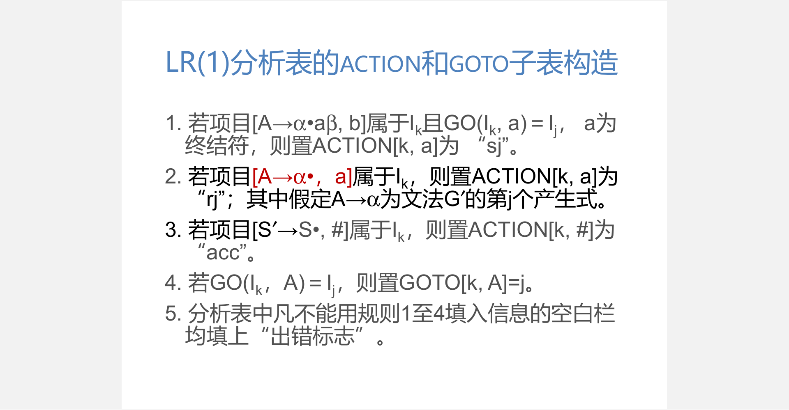

# 编译原理

[TOC]

# 概论

- 翻译程序
  - 某一种语言程序（源语言）等价转换成另一种语言程序（目标语言）
- 解释程序
  - 源程序作为输入，不产生目标程序，边解释边执行源程序

- 编译程序
  - 高级语言程序等价转换成等价低级语言程序（汇编或机器语言）
  - 分类
    - 诊断编译程序 Diagnostic Compiler
    - 优化编译程序 Optimizing Compiler
    - 交叉编译程序 Cross Compiler
    - 可变目标编译程序 Retargetable Compiler
  - 编译过程
    - 词法分析-词法规则-有限自动机
    - 语法分析-语法规则-上下文无关文法
    - 中间代码产生-语义规则-属性文法
    - 优化-程序的等价变换
    - 目标代码产生-指令系统
  - 结构
    - 词法分析器
    - 语法分析器
    - 语义分析与中间代码生成器
    - 优化段
    - 目标代码生成器
    - 符号表管理模块
    - 出错处理模块
  - 前端
    - 与源语言有关，包括词法分析、语法分析、语义分析与中间代码产生、与机器无关的优化
  - 后端
    - 与目标机有关，包括与目标机有关的优化、目标代码产生
- 遍（pass）
  - 对源程序或源程序的中间表示从头到尾扫描一遍
  - 一个阶段可以很多遍，也可以一遍完成很多阶段
- 语法
  - 词法规则
    - 单词符号的形成规则
    - 单词符号是语言中具有独立意义的最基本结构，如常数、标识符、基本字、算符、界符等
  - 语法规则
    - 语法单位的形成规则
    - 语法单位通常包括表达式、语句、分程序、子程序、过程、函数、程序
- 语义
  - 程序意义的定义规则

# 文法和语言

- 文法
  - 描述语言的语法结构的形式规则

## 基本概念

- 字母表：符号（字符）的非空有穷集

- 字符串：由某字母表中符号组成的有穷序列

- 空串：$\epsilon$，有 0 个字符的串

- 字符串的长度
  $$
  |w| = \begin{cases} 0 & w = \epsilon\\
  |x| + 1 & w = xa
  \end{cases}(a\in \Sigma)
  $$

- 字符串的连接
  $$
  x\cdot y = \begin{cases}x & y = \epsilon\\
  (x\cdot z)a & y = za
  \end{cases}(a\in \Sigma)
  $$

- 字符串的幂
  $$
  x^n = \begin{cases}
  \epsilon & n = 0\\
  x^{n-1}x & n \ge 1
  \end{cases}
  $$

- 集合的连接
  $$
  A\cdot B = \{w | w = x\cdot y, x\in A \and y \in B\}
  $$

- 集合的幂
  $$
  A^n = \begin{cases}
  \{\epsilon\} & n = 0\\
  A^{n-1}A & n\ge 1
  \end{cases}
  $$

- 克林闭包
  $$
  \Sigma^* = \bigcup_{i=1}^{\infin} \Sigma^i
  $$

- 正闭包
  $$
  \Sigma^+ = \bigcup_{i=1}^{\infin}\Sigma^i
  $$
  显然有
  $$
  \Sigma^* = \Sigma^+ \cup \{\epsilon\}
  $$

- 语言：若$\Sigma$为字母表（有穷性），且有$\forall L \sube \Sigma^*$，则$L$称为字母表$\Sigma$上的语言

- 形式化证明

  - 归纳法
  - 演绎法
  - 反证法

## 上下文无关文法

上下文无关文法$G$是一个四元组$G=(V_T,V_N,S,P)$

- $V_T$是非空终结符集合
- $V_N$是非空非终结符集合
- $V_T\cap V_N=\empty$
- $S$是文法的开始符号，属于非终结符集，至少必须在某个产生式左部出现一次
- $P$为有限产生式集合，$\{L\rightarrow \alpha | L\in V_N , \alpha \in (V_T\cup V_N)^*\}$

## 语言相关概念

- 推导
  - 称$\alpha A \beta$直接推出$\alpha \gamma \beta$，即$\alpha A \beta \Rightarrow \alpha \gamma \beta$仅当$A\Rightarrow \gamma$是一个产生式
  - 至少一次推导$\overset{+}\Rightarrow $，至少零次推导$\overset{*}\Rightarrow$
- 规约
  - 如果$\alpha A \beta \Rightarrow \alpha \gamma \beta$，则称$\alpha\gamma\beta$归约到$\alpha A\beta$。

- 句型
  - 假定文法$G$，开始符号$S$，如果$S\overset{*}\Rightarrow \alpha$则称$\alpha$是其的一个句型
- 句子
  - 仅含终结符的句型是一个句子
- 短语
  - 设文法$G$的句型$\alpha\beta\delta$，如果有$S\overset{*}\Rightarrow\alpha A\delta$，且有$A\overset{+}\Rightarrow\beta$，则称$\beta$是句型$\alpha\beta\delta$的相对于非终结符$A$的短语
  - 如果是一次推导得到的，则称该短语为直接短语或者简单短语
- 语言
  - 文法所产生的句子的集合是一个语言，记作$L(G)$
  - 文法的等价在于从文法产生的语言是相同的
- 最左推导
  - 每一步推导都是对左部的最左非终结符进行替换
- 最右推导
  - 每一步推导都是对左部的最右非终结符进行替换
  
- 语法树
  - 表示一个句型的推导过程，表示不同推导过程的共性抽象
- 二义性
  - 一个句型不一定对应唯一一棵语法树
  - 如果一个文法存在某个句子对应两棵不同的语法树，则该文法是二义的
  - 如果一个对一个语言不存在无二义的文法，则该语言是二义的
  - 文法的二义性判定问题是递归不可解的，不存在判定算法
- 形式语言
  - 基本构成
    - $V_T$是非空终结符集合
    - $V_N$是非空非终结符集合
    - $V_T\cap V_N=\empty$
    - $S$是文法的开始符号，属于非终结符集
    - $P$为有限产生式集合
  - 分类，依据产生式的形式，约束从上往下增加，前者真包含后者
    - 0型-短语文法：$\alpha\rightarrow \beta(\alpha,\beta\in (V_T\cup V_N)^*)$，其中$\alpha$至少包含一个非终结符
    - 1型-上下文有关文法：$\alpha\rightarrow \beta(|\alpha|\le|\beta|)$，仅$S\rightarrow\epsilon$除外
    - 2型-上下文无关文法：$L \rightarrow \alpha (L\in V_N , \alpha \in (V_T\cup V_N)^*)$
    - 3型-正规文法：
      - 右线性文法：$A\rightarrow \alpha B 或 A\rightarrow \alpha (A,B\in V_N,\alpha\in V_T^*)$
      - 左线性文法：$A\rightarrow B \alpha 或 A\rightarrow \alpha (A,B\in V_N,\alpha\in V_T^*)$
      - 左右线性文法是等价的

# 词法分析

## 正规集与正规式

- 正规集
  - 正规集是语言定义的合法单词的集合
  - 正规集相同，正规式等价
- 正规式
  - 表示正规集的方法
  - 一个字符串是正规集当且仅当它能用正规式表示
- 定义
  - 对于给定字母表$\Sigma$，$\epsilon$和$\empty$都是$\Sigma$上的正规式，它们所表示的正规集为$\{\epsilon\}$和$\empty$
  - 任何$a\in\Sigma$，$a$是$\Sigma$上的正规式，它所表示的正规集为$\{a\}$
  - 假定$e_1$和$e_2$都是$\Sigma$上的正规式，它们所表示的正规集为$L(e_1)$和$L(e_2)$
    - $(e_1|e_2)$也是正规式，对应的正规集为$L(e_1)\cup L(e_2)$
    - $(e_1\cdot e_2)$也是正规式，对应的正规集为$L(e_1)L(e_2)$
    - $(e_1)^*$也是正规式，对应的正规集为$(L(e_1))^*$
    - 仅由上述有限次变换得到的表达式为正规式
- 定律
  - 交换律：$r|s=s|r$
  - 结合律：$(r|s)|t=r|(s|t),(r\cdot s)\cdot t=r\cdot (s\cdot t)$
  - 分配律：$r\cdot (s|t)=r\cdot s| r\cdot t,(s|t)\cdot r=s\cdot r| t\cdot r$

## 有穷自动机

#### 抽象模型

- 一条输入带（输入数据）
- 一个读取头（转移规则）
- 一个有穷控制器（状态表示，初始状态，接受状态）

### 确定的有穷自动机（DFA）

$$
A = (Q, \Sigma, \delta, q_0, F)
$$

- $Q$：有穷状态集
- $\Sigma$：有穷输入符号集或字母表
- $\delta$：$Q\times \Sigma \rightarrow Q$，状态转移函数
- $q_0\in Q$：唯一初始状态
- $F\sube Q$：接受状态集

确定的意思在于，对任意状态$a$，给定输入字符$q$，$\delta$能够给出确定的目标状态$b$，即$\delta(q,a) = b\in Q$。

一般用状态转移图或者状态转移表来表示

#### 扩展转移函数

扩展$\delta$到字符串，定义扩展转移函数$\hat\delta: Q \times \Sigma^* \rightarrow Q$为
$$
\hat\delta(q,w) = \begin{cases} 
q & w = \epsilon\\
\delta(\hat\delta(q,x),a) & w = xa
\end{cases}(a\in\Sigma, w,x\in\Sigma^*)
$$

#### 正则语言

对于一个DFA，$D = (Q,\Sigma,\delta,q_0,F)$，则$D$接受的语言为正则语言
$$
\mathbf{L}(D) = \{w\in \Sigma^*|\hat\delta(q_0,w)\in F\}
$$

### 非确定的有穷自动机（NFA）

$$
A = (Q, \Sigma, \delta, q_0, F)
$$

- $Q$：有穷状态集
- $\Sigma$：有穷输入符号集或字母表
- $\delta$：$Q\times  \Sigma  \rightarrow 2^Q$，状态转移函数（$2^Q$表示$Q$的幂集）
- $q_0\in Q$：初始状态
- $F\sube Q$：接受状态集

非确定的意思在于：

1. 同一个状态在相同的输入下，可以有多个转移状态
2. 自动机可以处在多个当前状态

注意：非确定性没有增加有穷自动机的能力

#### 扩展转移函数

扩展$\delta$到字符串，定义扩展转移函数$\hat\delta: Q \times \Sigma^* \rightarrow 2^Q$为
$$
\hat\delta(q,w) = \begin{cases} 
q & w = \epsilon\\
\bigcup_{p\in\hat\delta(q,x)}\delta(p,a) & w=xa
\end{cases}(a\in\Sigma, w,x\in\Sigma^*)
$$

#### NFA接受的语言

对于一个NFA，$N = (Q,\Sigma,\delta,q_0,F)$，则$N$接受的语言为正则语言
$$
\mathbf{L}(N) = \{w\in \Sigma^*|\hat\delta(q_0,w)\cap F \ne \empty \}
$$

### DFA和NFA的等价性

如果语言$L$被NFA接受，当且仅当$L$被DFA接受

#### 子集构造法

如果NFA，$N=(Q_N,\Sigma,\delta_N,q_0,F_N)$，构造DFA，$D = (Q_D,\Sigma,\delta_D,\{q_0\},F_D)$

1. $Q_D = 2^{Q_N}$
2. $F_D = \{S|S\sube Q_N,S\cap F_N\ne \empty\}$
3. $\forall S\sube Q_N, \forall a\in \Sigma, \delta_D(S,a)=\bigcup_{p\in S}\delta_N(p,a)$

则有$\mathbf{L}(D) = \mathbf{L}(N)$。

### 带空转移的非确定有穷自动机（$\epsilon$-NFA​）

$$
A = (Q, \Sigma, \delta, q_0, F)
$$

- $Q$：有穷状态集
- $\Sigma$：有穷输入符号集或字母表
- $\delta$：$Q\times (\Sigma\cup\{\epsilon\}) \rightarrow 2^Q$，状态转移函数（$2^Q$表示$Q$的幂集）
- $q_0\in Q$：初始状态
- $F\sube Q$：接受状态集

#### 状态集合的$\epsilon$闭包

$$
ENCLOSURE(S) = \bigcup_{q\in S}ENCLOSURE(q)
$$

#### 扩展转移函数

扩展$\delta$到字符串，定义扩展转移函数$\hat\delta: Q \times \Sigma^* \rightarrow 2^Q$为
$$
\hat\delta(q,w) = \begin{cases} 
ENCLOSURE(q) & w = \epsilon\\
ENCLOSURE(\bigcup_{p\in\hat\delta(q,x)}\delta(p,a)) & w=xa
\end{cases}(a\in\Sigma, w,x\in\Sigma^*)
$$

#### $\epsilon$-NFA接受的语言

同NFA。

### DFA和$\epsilon$-NFA的等价性

如果语言$L$被$\epsilon$-NFA接受，当且仅当$L$被DFA接受

#### 子集构造法

如果$\epsilon$-NFA，$N=(Q_E,\Sigma,\delta_E,q_E,F_E)$，构造DFA，$D = (Q_D,\Sigma,\delta_D,\{q_0\},F_D)$

1. $Q_D = 2^{Q_E}$，或$Q_D=\{S\sube Q_E | S= ENCLOSURE(S)\}$
2. $q_D=ENCLOSURE(q_E)$
3. $F_D = \{S|S\sube Q_D,S\cap F_E\ne \empty\}$
4. $\forall S\sube Q_D, \forall a\in \Sigma, \delta_D(S,a)=ENCLOSURE(\bigcup_{p\in S}\delta_N(p,a))$

则有$\mathbf{L}(D) = \mathbf{L}(E)$。

### DFA的最小化

- 状态的可区分性
  - 存在字符串$\alpha$，使得状态$s$在接收后停止与终态，而状态$t$在接收后停止于非终态，或者反之，则称状态$s$与$t$是可以区分的

- 划分目标
  - 将原DFA的状态集$M$划分为不相交的子集，使得任意两个不同子集间的状态是可区分的，任意子集内部的状态是不可区分的

- 划分步骤
  - 首先，分为终态和非终态两个子集
  - 循环执行，目前已经划分了m个子集，如果存在一个输入字符使得某一子集的目标转移状态集合不会包含目前划分中的某一子集，则该子集需要进一步划分
  - 对于划分的子集，按照该子集内状态在接受某一输入字符后的目标转移状态来划分即可
  - 含有原初态和原终态的子集称为新的初态和终态

## 正规式和有限自动机

一个正规式与一个有限自动机等价。

### 有限自动机转换到正规式

- 添加总的初始状态$X$和终止状态$Y$
- 有限次使用三条转换规则
  - 连续的两个弧可以转换为$\cdot$
  - 自环可以转换为$*$
  - 重边可以转换为$|$

- 最后只剩下$X$和$Y$即可，弧上的正规式即为所求

### 正规式转换到有限自动机

上述转换方式反过来即可

# 语法分析

## 自上而下分析

- 自上而下分析存在的问题
  - 多个候选式导致回溯开销
  - 文法左递归导致死循环

### 消除直接左递归

- 直接左递归：$P\rightarrow P\alpha_1|P\alpha_2|\ldots|P\alpha_m | \beta_1|\beta_2|\ldots|\beta_n$，$\beta_i$不以$P$开头
- 消除：$P\rightarrow \beta_1 P'|\beta_2P'|\ldots|\beta_nP' \\ P'\rightarrow \alpha_1 P'| \alpha_2 P'|\ldots|\alpha_m P'| \epsilon$

### 消除间接左递归

- 前提
  - 不含以$\epsilon$为右部的产生式
  - 不含回路$P\overset{+}\rightarrow P$

- 消除
  - 先找间接递归的环
  - 将环转换为自环
  - 获得直接左递归并消除
  - 删掉无用产生式

### 消除回溯

- FIRST集合
  - $FIRST(\alpha)=\{a|\alpha\overset{*}\Rightarrow a\ldots,a\in V_T\}$
  - 若$\alpha \overset{*}\Rightarrow \epsilon$，则$\epsilon \in FIRST(\alpha)$
  - 如果某个非终结符的候选符的FIRST集合两两不相交，则可以准确地进行推导
  - 左公因子会导致相交，所以要消除
- 提取左公因子：$A\rightarrow \delta \beta_1|\delta\beta_2|\ldots|\delta\beta_n|\gamma_1|\gamma_2|\ldots|\gamma_m$，$\gamma_i$不以$\delta$开头
- 消除：$A\rightarrow \delta A'|\gamma_1|\gamma_2|\ldots|\gamma_m\\A'\rightarrow \beta_1|\beta_2|\ldots|\beta_n$

### $\epsilon$候选

- FOLLOW集合

  - $FOLLOW(A)=\{ a| S\overset{*}\Rightarrow \ldots Aa\ldots,a\in V_T\}$
  - 若$S\overset{*}\Rightarrow\ldots A$，则$\#\in FOLLOW(A)$

  - FOLLOW集的意义在于当前读取的字符不在候选符集中，而有$\epsilon$，那么当前的非终结符可以不处理当前字符，交由之后能处理掉它的非终结符

### LL(1)文法

- 条件
  1. 文法不含左递归
  2. 对于任意一个非终结符，它的各个产生式的候选FIRST集两两不相交
  3. 对于任意一个非终结符，如果它的候选FIRST集中包含$\epsilon$，则它的各个产生式的候选FIRST集与其FOLLOW集都不相交

- 

### LL(1)分析

- 对文法进行消除左递归和提取左公因式
- 计算FIRST集和FOLLOW集
  - 
  - 
  - 
- 根据计算完后的FIRST集和FOLLOW集来判断是否LL(1)
- 如果是LL(1)就可以使用LL(1)分析法
  - 

### 预测分析

- 构成
  - 总控
  - 分析表$M[A,a]$
  - 分析栈
- 预测分析表的构造
  - 
  - 构造算法的内容实际上就是求生成式的SELECT集
- SELECT集
  - 对于产生式$A\rightarrow \alpha,A\in V_N,\alpha\in (V_N+V_T)^*$，若$\alpha\overset{*}\Rightarrow \epsilon$，则$SELECT(A\rightarrow \alpha)=(FIRST(\alpha)-\{\epsilon\})\cup FOLLOW(A)$，否则$SELECT(A\rightarrow \alpha)=FIRST(\alpha)$

- 如果一个文法是左递归或者二义的，则分析表中至少存在一个多重定义的入口。LL(1)文法是无二义的
  - 多重定义表现在SELECT集上为$SELECT(A\rightarrow \alpha)\cap SELECT(A\rightarrow \beta)\ne\empty$。即存在相同左部的生成式的SELECT集相交

## 自下而上分析

### 短语与可规约串

- 基于栈的移进规约分析，主要问题在于识别可规约串
- 分析树和语法树未必一样。规约过程可以用符号栈+输入串+产生式的三元组表示
- 可规约串实际上是语法树中的短语。因此，直接短语则意味着可以立即规约
- 以某非终结符为根的两代以上的子树的所有末端结点从左到右排列就是相对于该非终结符的一个短语，如果子树只有两代，则就是直接短语

### 算符优先分析

- 结构
  - 总控
  - 符号栈
  - 算符优先关系表

- 算符文法
  - 一个文法，如果它的任意产生式的右部都不含两个相继的非终结符，即不含$\ldots QR\ldots$形式的产生式右部，则称其为算符文法。
- 分析思路
  - 按照算符的优先关系和结合性质进行分析

- 优先关系
  - 分类
    - $a =\hskip-0.8em\cdot\hskip0.6em b$：a的优先级等于b
    - $a\lessdot b$：a的优先级低于b
    - $a \gtrdot b$：a的优先级高于b
  - 要点
    - $+ \lessdot +$是成立的，表示右结合
    - $a\lessdot b$并不意味着$a\gtrdot b$，即左右位置敏感
- 算符优先文法
  - 
  - 图片右上角的红色文法不是算符优先文法，紫色文法是算符优先文法
- 优先关系表
  - 
  - 如果存在冲突项，则该文法不是算符优先文法
- FIRSTVT集与LASTVT集
  - $FIRSTVT(P) = \{ a| P\overset{+}\Rightarrow a\ldots \text{or}\ P\overset{+}\Rightarrow Qa\ldots , a\in V_T ,Q\in V_N\}$
  - $LASTVT(P)= \{ a| P\overset{+}\Rightarrow \ldots a\ \text{or}\ P\overset{+}\Rightarrow \ldots aQ , a\in V_T ,Q\in V_N\}$
  - 
  - 

- 素短语
  - 相对于一个文法G的句型
  - 至少包含一个终结符
  - 除它自身外不再包含任何更小的素短语
  - 最左素短语是该句型最左边的素短语
  - 
- 算符优先分析得出的结果不一定是语法树，因为它的规约只要求了栈顶的最左素短语中终结符的相同，非终结符并没有要求，因此得到的分析树可能要比语法树简单一点。正因如此，算符优先文法可能接收错误的句子，但是它对于表达式的分析很快且简单

### 规范规约

- 句柄
  - 句型的最左直接短语为该句型的句柄
- 定义
  - 假定$\alpha$是文法G的一个句子，我们称序列$\alpha_n,\alpha_{n-1},\alpha{n-2},\ldots,\alpha_0$是$\alpha$的一个规范规约，如果此序列满足
    - $\alpha_n=\alpha$
    - $\alpha_0$为文法开始符号
    - 对任何$i,0\lt i\le n$，$\alpha_{i-1}$是从$\alpha_i$经把句柄替换成为相应产生式左部的符号而得到的
  - 上述定义其实就是最左规约，是最右推导的逆过程
- 最右推导又称规范推导，得到的句型称为规范句型
- 算符优先分析不属于规范规约分析，但是二者的结果结构类似
- 规范规约的目标就是找句柄，依据已移入符号栈的内容、根据产生式推测接下来可能遇到的符号、和当前符号

### LR(k)文法

- LR文法
  - 对于一个文法，如果能构造一张分析表，且分析表的入口都是唯一确定的，则该文法为LR文法
- LR(k)文法
  - 对于一个文法，如果能用一个每步至多向前检查k个输入符号的LR分析器进行分析，则该文法为LR(k)文法。
- LR文法不是二义的，LR文法是无二义文法的子集

### LR(0)分析

- 结构
  - 分析栈（状态+符号）
  - 总控
  - LR分析表（ACTION+GOTO）

- LR分析的核心是LR分析表
  - $ACTION[s,a]$表示当状态s获得输入符号a时，应采取的动作
  - $GOTO[s, X]$表示状态s面对文法符号X时，下一个状态

- LR分析中，栈内的符号串与剩余符号串构成一个规范句型
- LR分析中，当栈顶出现句柄则马上进行规约

- 拓广文法
  - 保证文法的初始符号只出现一次，且不出现在任何产生式的左部

- 活前缀
  - 规范句型的一个前缀
  - 不含句柄之后的任何符号
  - 对于规范句型$\alpha\beta\delta$，其中$\beta$为句柄，$\delta$必为终结符串，如果$\alpha\beta=u_1u_2\ldots u_r$，则符号串$u_1u_2\ldots u_i(1\le i\le r)$是该规范句型的活前缀。
- LR(0)项目
  - 在每一个产生式的右部添加一个圆点
  - 表示在分析过程中看到了产生式的哪些部分
  - 点在左部的末尾，该项目为规约项目，特殊的，对于拓广后的开始符号，该项目为接收项目
  - 点在终结符之前，该项目为移进项目
  - 点在非终结符之前，该项目为待约项目
- LR(0)项目集规范族
  - 构成识别一个文法活前缀的DFA的项目集（状态）的全体称为文法的LR(0)项目集规范族
- 项目集闭包
  - 假定$I$是文法$G$的任意项目集，则其闭包$CLOSURE(I)$满足
    - $I$的任何项目都属于闭包
    - 若$A\rightarrow\alpha \cdot B\beta$属于该闭包，那么对于任何$B\rightarrow \gamma$，项目$B\rightarrow \cdot \gamma$也属于该闭包
    - 重复上两步骤，直到该闭包不再增大
- 有效项目
  - 
  - 

- 状态转换函数
  - $I$是一个项目集，$X$是一个文法符号，$GO(I,X)=CLOSURE(J)$，其中$J=\{任何形如A\rightarrow\alpha X\cdot \beta的项目| A\rightarrow \alpha \cdot X\beta属于I \}$
  - 直观上说，若$I$是对某个活前缀$\gamma$有效的项目集，那么$GO(I,X)$就是对$\gamma X$有效的项目集

- LR(0)文法
  - 若一个文法的拓广文法的活前缀识别自动机中每一个状态（项目集）不存在既含有移进项目又含有规约项目或者含有多个规约项目，则该文法是一个LR(0)文法。
  - 或者说不存在移进-规约冲突和规约-规约冲突
- LR(0)分析表
  - 

### SLR(1)分析

- SLR(1)仅仅是在LR(0)的基础上增加移进-规约冲突的处理办法
- 

- 

### LR(1)分析

- LR(k)项目
  - 
- 有效项目
  - 
  - 
- 项目集闭包
  - 
- 转换函数
  - 
- 构造分析表
  - 

- LR(0)$\subset$SLR(1)$\subset$LR(1)

# 属性文法与语法制导翻译

- 属性文法，又称属性翻译文法
  - 以上下文无关文法为基础
  - 为每个文法符号配备若干相关属性，代表与文法符号相关的信息
  - 为文法的每个产生式都配备一组属性的语义规则，对属性进行计算和传递
- 综合属性
  - 自下而上传递信息
  - 根据右部中的符号的属性计算左部被定义符号的综合属性
  - 或者，根据子节点的属性和父节点的自身属性计算父节点的综合属性
- 继承属性
  - 自上而下传递信息
  - 根据右部中的符号的属性和左部被定义的符号的属性计算右部中的符号的继承属性
  - 或者，根据父节点和兄弟节点的属性计算子节点的继承属性
- 属性依赖
  - 语义规则的通用形式：$b:=f(c_1,c_2,\ldots,c_k)$
  - 上述规则称为：属性$b$依赖于属性$c_1,c_2,\ldots,c_k$
    - $b$是产生式左部的综合属性，$c_1,c_2,\ldots,c_k$是产生式右部的文法符号的属性
    - $b$是产生式右部的某个文法符号的继承属性，$c_1,c_2,\ldots,c_k$是产生式左部或者产生式右部的文法符号的属性
    - 上两种情况对应综合属性和继承属性的定义
  - 终结符只有综合属性，它由词法分析器给出
  - 非终结符既可有综合属性，又可有继承属性
  - 文法开始符号的所有继承属性作为属性计算之前的初始值
- 语义规则
  - 对产生式右部文法符号的继承属性和左部文法符号的综合属性都必须提供一个计算规则，属性计算规则只能使用相应产生式中的文法符号的属性
  - 对产生式左部文法符号的继承属性和右部文法符号的综合属性不由所给的产生式的属性计算规则进行计算，由其他产生式的属性规则计算或由外部给出
  - 自下而上分析中，一个产生式匹配输入串成功时计算
  - 自上而下分析中，一个产生式被用于进行规约时计算
- S属性文法
  - 只含有综合属性
  - 在自下而上分析中计算综合属性
  - 分析栈中保存语法符号和有关的综合属性值
  - 每当进行规约时，新的语法符号的属性值就由栈中正在规约的产生式右部语法符号的属性值来计算
- L属性文法
  - 
  - 适合一遍扫描的自上而下分析
  - 实际上L属性文法定义了兄弟结点之间的关系
- 翻译模式
  - 语义规则仅给出了属性计算的定义，没有属性计算的次序等实现细节
  - 翻译模式给出了使用语义规则进行计算的次序，即表示实现细节
  - 在翻译模式中，和文法符号相关的属性和语义规则用花括号括起来，插入到产生式右部合适的位置上
  - 设计翻译模式时，必须保证当某个动作引用一个属性时它必须是具有定义的，L属性文法能够保证这一点
  - 建立方法
    - 如果只需要综合属性，则为每一个语义规则建立一个包含赋值的动作，并把这个动作放在相应产生式右部的末尾
    - 如果既包含综合属性又包含继承属性，则必须保证
      - 产生式右部文法符号的继承属性必须在这个符号以前的动作中计算出来
      - 一个动作不能引用这个动作右边符号的综合属性
      - 产生式左部非终结符的综合属性只有在它所引用的所有属性全部计算出来后才能计算，这种动作一般放在末尾
  - 语义动作执行时机统一
    - 加入新的产生式$M\rightarrow \epsilon$，把嵌入在产生式中的语义动作用非终结符$M$带替，并将动作放在新的产生式的末尾
  - 消除翻译模式中的左递归
    - 

# 语义检查和中间代码生成

- 赋值语句
  - 
- 数组寻址
  - 
  - 
  - 
  - 
  - 
- 布尔表达式
  - 
  - 
  - 
  - 
  - 
- 分支
  - 
- 循环
  - 
- 复合语句/块语句
  - 
  - 

# 代码优化和目标代码生成

- 基本块
  - 划分
    - 入口语句
      - 程序的第一条语句
      - 跳转语句的目标语句
      - 跳转语句的下一条语句
    - 出口语句
      - 跳转语句
      - 停止语句
      - 下一个入口语句的上一条语句
    - 无用语句
      - 不属于任何一个基本块的语句
  - 基本块划分之后可以将无用语句删除，因为无用语句在程序实际执行的过程中是无法到达的
  - 
  - 
- 流图
  - 以基本块为节点集，第一个节点是含有程序第一条语句的基本块
  - 边则是程序走向的抽象表示，即
    - 如果基本块j紧跟在基本块i之后，且i的出口语句不是无条件跳转语句，停止语句，则存在i到j的一条有向边
    - 如果基本块i的出口语句是跳转语句，则存在i到目标语句所在基本块j的一条有向边
  - 对于流图中的节点序列，如果序列之外有一个节点指向序列之内的一个节点，或者序列之内存在程序首节点，则这种节点称为节点序列的入口节点
  - 循环是流图中独特的节点序列，它是强连通子图，仅有一个入口节点
  - 

- DAG
  - 
  - 
  - 
  - 
  - 

## 基本块内优化

- 一个基本块可以用一个DAG表示

- 对于基本块中的没一条四元式代码，依次构造对应的DAG图，最后基本块中所有四元式构造出来DAG连成整个基本块的DAG
  - 准备操作数的节点
  - 合并已知量
  - 删除公共子表达式
  - 删除无用赋值

- 
- 
- 
- 

## 循环优化

### 代码外提

### 强度削弱

## 其他

- 窥孔优化
  - 删除冗余存取指令：从某个内存单元取数，然后又存到原内存单元，期间值并没有变化
  - 常量合并：编译期能计算出来的常量表达式可以由编译器计算出值
  - 常量传播：某寄存器被初始化为一个常量，之后多次调用该寄存器，则可以直接用常量来替换该寄存器调用，更进一步，该寄存器如果没有再修改或引用，则可以直接删掉初始化，用常量代替即可
  - 控制流优化：跳转语句的目标语句是一个无条件跳转语句，则可以直接跳到无条件跳转语句的目标语句
  - 死代码删除：条件跳转的条件始终为假或真，删除不可达分支
  - 强度削弱：乘转加，除转乘
  - 使用目标机惯用指令：加1转自增，乘除2幂转左右移

