[TOC]

# 程序的机器级表示

## 历史观点

### Intel处理器演变过程

- 8086——1978——29K
- 80286——1982——134K
- i386——1985——275K
- i486——1989——1.2M
- Pentium——1993——3.1M
- PentiumPro——1995——5.5M
- Pentium/MMX——1997——4.5M
- Pentium II——1997——7M
- Pentium III——1999——8.2M
- Pentium 4——2000——42M
- Pentium 4E——2004——125M
- Core 2——2006——291M
- Core i7 Nehalem——2008——781M
- Core i7 Sandy Bridge——2011——1.17G
- Core i7 Haswell——2013——1.4G

### 摩尔定律

晶体管数量每26月翻一番。

### 观点

之前的晦涩难懂的特性已经不会再出现了。学习机器级代码的意义我认为有三：

1. 从底层的角度来学习优化代码，分析代码中隐含的低效率
2. 了解程序运行时的行为
3. 编写安全的代码，了解程序漏洞是如何出现的，了解攻击手段和防御措施

## 程序编码

### 机器级代码

对于机器级编程来说，有两个重要抽象：

1. 由指令集体系结构或指令集架构（Instruction Set Architecture，ISA）来定义机器级程序的格式和行为，它定义了处理器状态、指令的格式，以及每条指令对状态的影响。大多数ISA都将程序的行为描述为按顺序执行每条指令。这是编译器的目标，提供一系列指令告诉机器要做什么。而微结构（Microarchitecture）是指这个架构的实现。
2. 机器级程序使用的内存地址是虚拟内存地址，使得内存模型看上去是一个很大的连续字节数组。然后由操作系统将其转换为真实的物理内存地址。在任意给定的时刻，只有有限的一部分虚拟地址是合法的。

机器级编程对于程序员来说将会有更多可见的数据：

- 程序计数器（Program Counter）指示了下个指令的内存地址。
- 程序员实际使用的寄存器（Register），可以看成非常小的内存，可以通过特定名字来指定。
- 只有几个位的状态码（Condition Codes）指示了最近一些指令的运行结果，比如是否产生0、是否产生负数或正数等等。这些值可以用来实现条件分支。

从源代码转为机器代码的过程：

- 预处理器会扩展源代码，插入所有用#include指令的文件，扩展所有用#define声明指定的宏。
- 编译器基于编程语言的规则、目标机器的指令集和操作系统的惯例，会将源代码转换为汇编代码作为输出，给出程序的每一条指令。
- 汇编器将汇编代码转化为二进制目标代码文件，它是机器代码的一种形式，包含了所有指令的二进制表示，但是还没有填入全局值的地址。
- 链接器将目标代码文件和实现库函数的代码合并，产生最终可执行代码文件。

需要注意的几点：

1. AT&T汇编和Intel汇编的区别。
2. C与汇编的结合方式：C语言内联汇编、汇编调用C语言编写的函数。

## 数据格式

| C        | Intel数据类型 | 汇编代码后缀 | 大小（字节） |
| -------- | ------------- | ------------ | ------------ |
| `char`   | 字节          | b            | 1            |
| `short`  | 字            | w            | 2            |
| `int`    | 双字          | l            | 4            |
| `long`   | 四字          | q            | 8            |
| `char*`  | 四字          | q            | 8            |
| `float`  | 单精度        | s            | 4            |
| `double` | 双精度        | l            | 8            |

## 访问信息

### 寄存器

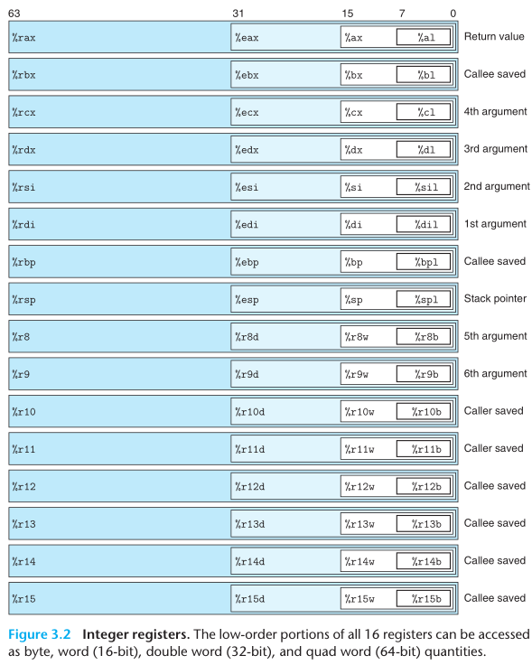

一个x86-64的CPU中包含16个存储64位值的通用目的寄存器，可以用来存储整数数据和指针。有些寄存器有特殊用途：

- 栈指针`%rsp`用来指明运行时栈的结束位置。
- 比如`%rdi`、`%rsi`、`%rdx`、`%rcx`、`%r8`和`%r9`用来保存函数的参数。
- `%rip`用来保存当前执行指令的地址。
- `%rax`用来存放函数的返回值。

对于生成小于8字节结果的指令，有两条规则：

1. 生成1字节或2字节数据的指令会保持剩下的字节内容不变。
2. 生成4字节数据的指令会把高位4个字节置零。

### 操作数

- **立即数（Immediate）：**用来表示常数值，书写格式是在`$`后面跟一个标准C表示法表示的整数。
- **寄存器（Register）：**表示某个寄存器的内容。
- **内存引用：**它会根据计算出来的地址访问某个内存位置。有不同的寻址模式，最常用的是$Imm(r_b,r_i,s)$，其中，**要求寄存器大小都是64位的**，才能完整索引整个虚拟内存空间，并且不能使用`%rsp`。

### 寻址方式

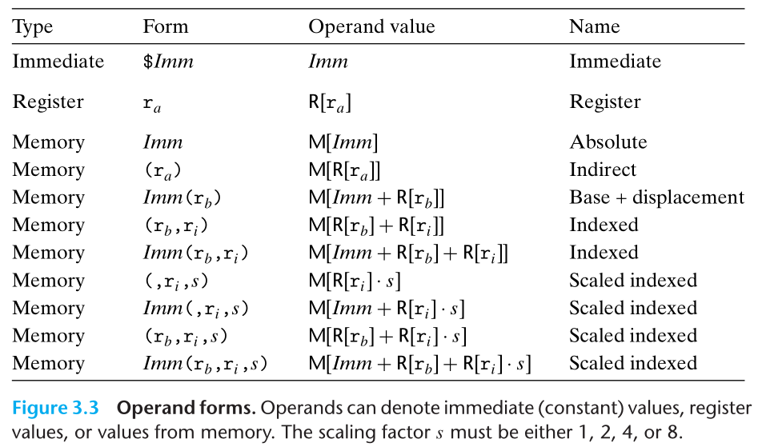

### 数据传送指令

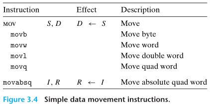

- 两个操作数不能同时为内存地址。如果要在两个内存位置传输数据，必须用一个寄存器进行中转，这是总线决定的，试想一下，CPU不可能一边输入一边输出。
- 使用到的寄存器大小一定要和指令最后一个字符指定的大小匹配。
- `movl`以寄存器为目的时，会将寄存器的高位4字节置0。x86-64的惯例，任何为寄存器生成32位值的指令都会把该寄存器的高位部分置成0。
- 如果用`movq`来传输立即数时，该立即数只能表示为32位补码，然后扩展到64位的值。而`movabsq`能够以任意64位立即数作为源操作数，并且只能以寄存器作为目的。


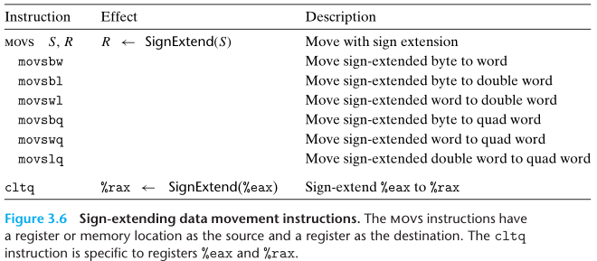

- 不存在`movzlq`，可以直接使用`movl`。因为当使用`movl`传输数据到32位目的寄存器中时， 会自动将目的寄存器的高位4字节置零。
- `cltq`没有操作数，总是以`%eax`作为源寄存器，以`%rax`作为目的寄存器，等价于`movslq %eax,%rax`。

对指针操作和强制类型转换的机器级理解：

1. 两个指针之间进行传输，由于是直接对内存进行操作的，所以需要先经过一个寄存器。
2. 小的数据类型转换到大的数据类型，是根据前面的数据类型决定是`MOVZ`还是`MOVS`。
3. 大的数据类型转换到小的数据类型时，先将其保存得到寄存器中，再将部分保存到内存中。

### 栈指令

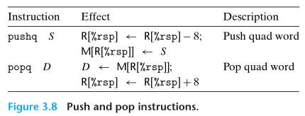

栈在处理过程调用中起着至关重要的作用，在内存中栈顶位于较小的内存地址中。入栈时，就需要先将栈顶地址增加，由此指向了要放数据的地址，然后将数据存入对应的内存中。出栈时，先从内存中取出对应的数据，然后再将栈地址减小，来指向当前的栈顶地址。这里使用一个特殊的寄存器`%rsp`来保存栈顶内存地址。

### 算数与逻辑指令

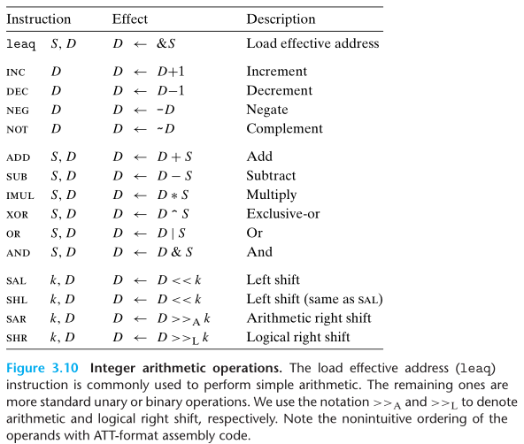

- `leaq S D`是将S计算出的地址付给寄存器D。通常会被用来执行加法和有限形式的乘法。比如对于比例变址寻址$Imm(r_b,r_i,s)$ ，得到的地址会是$Imm+r_b+s\cdot r_i$ ，所以`leaq Imm(%rax, %rbx, s), %rcx`就是将`Imm+%rax+s*%rbx`保存到`%rcx`。**注意：**目的操作数只能是寄存器。
- 一元操作符中，操作数可以是寄存器也可以是内存地址。
- 二元操作符中，第一个操作数可以是立即数、寄存器或内存地址；第二个操作数可以是寄存器或内存地址。
- 移位操作中，第一个操作数可以是立即数或放在**寄存器`%cl`**中，第二个操作数可以是寄存器或内存位置。**注意：**如果我们对w位的数据进行移位，则只考虑`%cl`中 ![[公式]](https://www.zhihu.com/equation?tex=log_2w) 位，保证不会将数据移出边界。 比如`salb`只会考虑低3位的值，`salw`只会考虑低4位的值，以此类推。
- 以上操作除了右移以外，在无符号数和补码间都是通用的，也体现了补码的优势。
- 可以使用`xorl %edx, %edx`来对寄存器`%rdx`置零。

### 特殊的计算指令

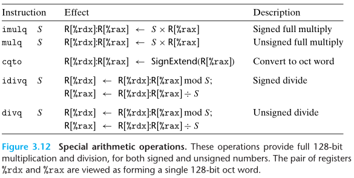

**有符号数除法：**

1. 将占用`%rax`和`%rdx`的数据`mov`到别的寄存器中
2. 将被除数中的64位`mov`到`%rax`中
3. 如果被除数是64位的，则要用`cqto`根据`%rax`中的最高有效位对`%rdx`进行符号扩展；如果被除数是128位的，就将剩下的64位`mov`到`%rdx`中
4. 使用`idiv`进行计算。

**无符号数除法：**

1. 将占用`%rax`和`%rdx`的数据`mov`到别的寄存器中
2. 将被除数中的64位`mov`到`%rax`中
3. 如果被除数是64位的，则使用`xorq %rdx, %rdx`将高64位置零；如果被除数是128位的，就将剩下的64位`mov`到`%rdx`中
4. 使用`div`进行计算。

**128位乘法：**

1. 将占用`%rax`的数据`mov`到别的寄存器中
2. 将其中一个乘数`mov`到`%rax`中
3. 如果是有符号乘法，就使用`imul`，如果是无符号乘法，就是用`mul`
4. 对结果进行保存，比如保存在`(%rdi)`中：如果是在小端机器中，则为`movq %rax, (%rdi)`，`movq %rdx, 8(%rdi)`；如果是打断机器中，则为`movq %rax, 8(%rdi)`，`movq %rdx, (%rdi)`。

## 控制

### 条件码


- `lea`不会设置条件码，因为它只是单纯计算地址。
- 逻辑操作的CF和OF会设置为0。
- 移位操作CF为最后一个被移出的位，OF=0。
- INC和DEC会设置OF和ZF，不会改变CF。

x86-64提供了另外两类指令，**只会设置条件码而不会改变目的寄存器**：

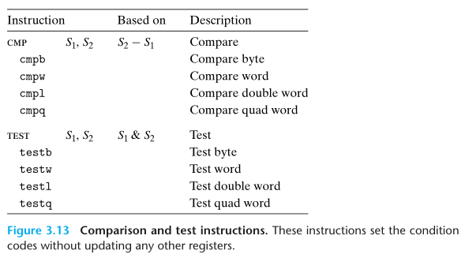

- `CMP S1, S2`：用来比较`S1`和`S2`，根据`S2-S1`的结果来设置条件码。主要用来比较两个数的大小。
- `TEST S1, S2`：用来测试`S1`和`S2`，根据`S1 & S2`的结果来设置条件码。可以将一个操作数作为掩码，用来指示哪些位用来测试。比如`testq %rax, %rax`就可以检查`%rax`是正数、负数还是0。

**注意：**使用`CMP`进行比较时，要注意顺序是相反的。比如`CMP S1, S2`得到大于的结果，则表示`S2`大于`S1`。

我们可以执行这两个指令后，自己根据条件码的组合来比较或测试结果，但是这里提供了一类`SET`指令，能够自动根据条件码的组合来得到结果。这里的目的操作数是**低位单字节寄存器**，或者一个字节的内存位置。如果要得到32位或64位结果，我们可以使用`MOVZ`对其进行传输。

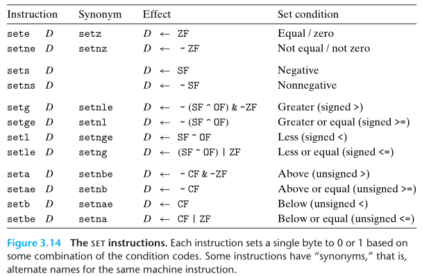

常见的**使用顺序**为：

1. 使用`CMP`进行比较或`TEST`进行测试，来设置条件码。
2. 根据条件码组合或者`SET`将结果保存在单字节寄存器中。
3. 使用`movbl`将结果保存在32位寄存器中，并且会自动设置高4字节为0。

### 跳转指令

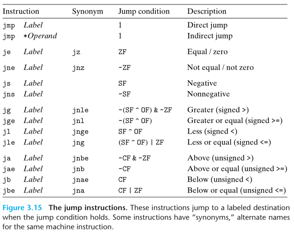

- **根据提供跳转目标的方式：**

- - **直接跳转：**跳转目标作为指令的一部分进行编码。汇编语言中，跳转目标通常用一个**标号（Label）**指明。在产生目标代码时，汇编器以及链接器会确定跳转目标的适当编码，并将其编码为跳转指令的一部分。
  - **间接跳转：**跳转目标从寄存器或内存位置中读取出来。需要在前面添加一个`*`，比如`jmp *%rax`就是跳转到寄存器`%rax`中保存的地址；`jmp *(%rax)`就是跳转到内存地址`(%rax)`中保存的地址。

- **根据跳转的条件：**

- - **无条件跳转：**没有任何条件，看到`jmp`就直接跳转。
  - **有条件跳转：**根据条件码组合来判断是否进行跳转。

对于直接跳转的跳转目标的编码，有**两种编码方式：**

- **PC相对的（PC-relative）：**跳转目标地址减去跳转指令下一条指令的地址的差。编码长度可以为1、2或4字节。
- **绝对地址：**用4字节直接给定目标地址。

跳转指令配合条件码可以用来实现高级语言的循环结构和分支结构，逻辑较为简单这里不再赘述。

## 过程

函数这一过程需要以下机制：

- **传递控制：**在进入函数Q的时候，程序计数器要设置为Q的代码的起始位置。从函数Q返回时，要把程序计数器设置为P中调用Q后面那条指令的地址，即从P中的断点处继续执行。
- **传递数据：**函数P必须能够向函数Q传递一个或多个参数，而函数Q必须能够向函数P返回一个值。
- **分配和释放内存：**开始时，函数Q可能需要为局部变量分配空间，而在返回前，又要释放这些存储空间。

### 栈帧

- 当函数需要的存储空间超出寄存器能够存放的大小，或者调用别的函数需要保存额外数据时，就会在栈上分配一个空间，这个空间称为函数的**栈帧（Stack Frame）**。
- 相对的，当某个函数的所有局部变量都能保存在寄存器中，并且不会调用任何的函数时，就无需开辟该函数的栈帧了。
- 当给一个函数创建栈帧时，编译器会给函数分配**所需**的**定长**的栈帧，在函数开始时就分配好后就不会改变了，所以栈顶指针`%rsp`就知道当函数返回时，需要释放多少空间。有些函数需要变长的栈帧，这些之后再说。

- 栈顶的栈帧对应了正在运行的函数。

- 因为未返回的函数都会在内存中保存自己的栈帧，而栈的空间是有限的，所以当调用过多时，会造成栈的溢出。
- 栈帧的组成（栈地址由高到低）：被保存的寄存器--局部变量--参数构造区--返回地址

### 被保护的寄存器

对除了栈指针`%rsp`外的所有寄存器分成两类：

- **被调用者保存寄存器：**`%rbx`、`%rbp`和`%r12`~`%r15`。这部分寄存是由被调用者。如果被调用者改变了这部分寄存器的值，就需要将其保存在被调用者自己栈帧中的**“被保存的寄存器”**中。当被调用者返回时，再将这部分寄存器的值根据内存复原。所以调用者可以假设“被调用者保存寄存器”的值是始终不变的。
- **调用者保存寄存器：**除了上面的寄存器外，都属于被调用者保存寄存器。 任何函数都能修改这些寄存器的值，并且不会保存在“被保存的寄存器”中，所以调用者要自己将这部分寄存的内容保存起来。所以调用者可以假设“调用者保存寄存器”的值是变化的，需要自己保存，可以用这部分寄存器保存临时值。

函数调用过程中对被保护的寄存器的操作：

1. 将要使用的“被调用者保存寄存器”`push`到栈中。（存储调用当前函数的函数的值）
2. 将除了“被调用者保存寄存器”的其他寄存器保存在空闲的“被调用者保存寄存器”中，如果保存不下，就将其保存在内存的“局部变量”区域
3. 调用其他函数
4. 释放 “局部变量”区域
5. 将“被调用者保存寄存器”的值通过`pop`从栈中恢复，顺序要和`push`时相反

### 局部变量

当函数需要保存的数据不多时，就会将数据保存在“被调用者保存寄存器”中。但是以下情况必须**保存在内存中**，该部分称为该函数的**局部变量：**

- “被调用者保存寄存器”不足以保存所有的本地数据
- 当一个局部变量使用取地址符&时，指的是返回该变量在内存中的地址，就必须将其保存在内存中
- 当局部变量是数组或结构时

函数调用过程中对局部变量的操作：

1. 申请局部空间，通过对栈顶指针`%rsp`减掉一个值
2. 根据数据大小，通过`%rsp`索引将数据保存在内存空间中
3. 根据传入参数顺序，将其保存到内存和寄存器中。参数大小要为8字节的倍数。
4. 释放局部空间，通过对栈顶指针`%rsp` 加上`1.`中的值

### 参数构造

在函数间传递数据，主要**通过寄存器**进行，x86-64提供了6个用于传递**参数**的寄存器，根据参数的顺序，需要放入特定的寄存器中。x86-64将寄存器`%rax`作为函数**返回值**的寄存器。


如果某个函数要传递超过6个参数的话，就需要将第7个到第n个参数保存在**栈**中，然后通过**栈顶指针`%rsp`**进行索引其中第7个参数在栈顶位置。要求每个参数的大小要为8字节的倍数。这部分区域称为**参数构造区**。保存在寄存器中的参数访问起来比保存在内存中快很多。

由于栈顶还要保存一个8字节的返回地址，所以第7个参数的地址为`8(%rsp)`，如果第7个元素大小不超过8字节，则第8个元素的地址为`16(%rsp)`，以此类推。

### 返回地址

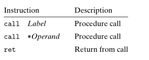

- `call`：可以直接将函数名作为跳转目标，其编码的计算方式和`jmp`相同。相当于`push`和设置`%rip`的组合。

- - 将栈指针减8，留出保存返回地址的空间
  - 将紧跟`call`指令后面那条指令的地址作为返回地址，保存到栈中。
  - 将程序计数器设置为调用函数的地址。

- `ret`：从当前函数返回，不需要操作数。相当于设置`%rip`和`pop`的组合。

- - 将程序计数器设置为栈顶元素。
  - 将栈指针加8。

## 数据

### 数组

对于数组声明`T A[N];`底层步骤如下：

1. 根据数据类型`T`的大小`L`字节，先在内存空间中分配一个大小为`L*N`的连续空间；
2. 将`A`作为这个连续内存空间的起始指针，即A的值`xA`就是该内存空间的起始地址。

当你声明了一个数组，你既为它分配了空间，并且创建了一个允许进行指针运算的数组名称。而当你声明一个指针时，你所分配的只有指针本身的空间，所以如果没有初始化指针，直接对其进行解引用可能会出现错误。

对于嵌套数组即高维数组，内存中按照行优先的形式进行保存。

#### 定长数组

对于定长的二维数组，gcc优化之后的代码将会使得像`A[i][j]`这样的寻址转变为指针间的操作以减少计算乘法产生的损耗。

#### 变长数组

ISO-C99允许数组的维度为表达式，在数组被分配时才计算出来。

变长数组的出现导致机器不能够第一时间获取数组的维度，因此其维度将会占用额外的寄存器，并且需要使用乘法指令来计算地址，故会导致无可避免的性能损失。

### 结构

C语言中，可以用`struct`声明创建一个**数据类型**，具有以下特点：

- **定义：**可以将不同类型的对象聚合到一个对象中，并使用名字来引用结构中的各个组成部分。
- **存储：**结构的所有组成部分都存放在内存中一段**连续的**区域内，指向结构的**指针**是结构第一字节的地址。
- **获得元素：**编译器会维护关于每个结构类型的信息，了解每个字段的偏移量，由此作为内存引用指令的唯一，来对结构元素进行引用。

#### 数据对齐

默认情况下，对齐的基本原则是任何K字节的基本对象的地址必须是K的倍数。

这里也可以人为使用预编译指令修改对齐参数进行限制。window是下默认对齐参数为8，Linux gcc没有设置默认参数。

**两个额外的要求：**

- 要求结构的初始地址一定是结构体中最大对象大小的倍数，使得偏移量加上初始地址才是真的满足倍数关系的。
- 在结构体末尾填充，使其是结构体中最大对象大小的倍数，使得结构数组中下一个元素的地址也是成倍数关系的。

### 联合

C语言中，可以用`union`声明创建一个**数据类型**，具有以下特点：

- **定义：**允许以多种类型来引用一个对象。
- **存储：**保存在**公共的**一块内存中，通过不同对象的类型来赋予这块内存不同的含义。内存大小为最大字段的大小。

## 浮点数

处理器的浮点体系结构包含多个方面，会影响对浮点数据操作的程序如何映射到机器上，包括：

- 如何存储和访问浮点数值
- 对浮点数据操作的指令
- 向函数传递浮点数参数和从函数返回浮点数结果的规则
- 函数调用过程中保存寄存器的规则

浮点寄存器

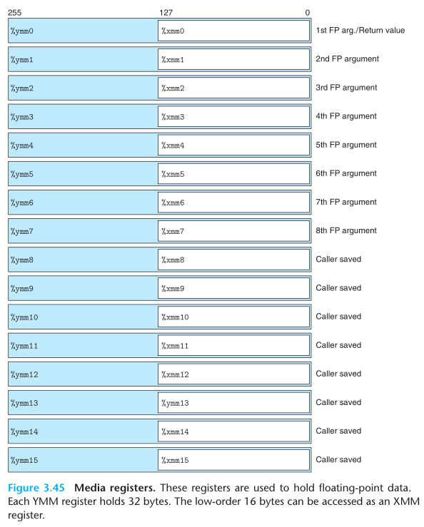

一个XMM寄存器，可以满足16个char、8个short、4个int、4个float和2个double同时进行操作，也就实现了SIMD运算。

在浮点运算中，指令被分成了**标量指令（Scalar Operations）**和**SIMD指令**，在指令中分别用`s`和`p`表示。

### 浮点传送指令

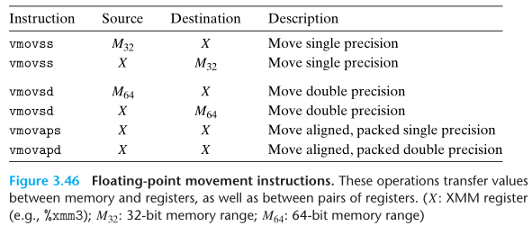

其中，引用内存的都是标量指令，而在两个XMM寄存器之间传送数据的是SIMD指令。其中`a`表示aligned，当读写内存时，要求满足16字节对齐（因为XMM是16字节的），否则会报错，而这里直接在两个XMM寄存器之间传输，绝不会出现错误对齐的情况。 建议32位内存数据满足4字节对齐，64位数据满足8字节对齐。

### 浮点转换指令

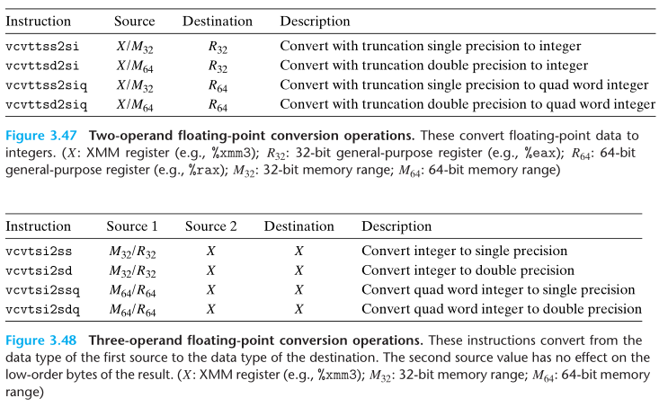

前面的`cvt`表示转换（convert），后一个`t`表示截断（truncated）。在将浮点数转换成整数时，指令会执行截断，把值向0进行舍入。可以发现这些都是标量指令。

在整型转换成浮点数时，提供了三操作数指令，这里通常可以忽略第二个操作数，因为它的值只会影响高位字节，通常使用目的寄存器。常见的使用方式为`vcvtsi2sdq %rax, %xmm1, %xmm1` 。

```asm
# Conversion from single to double precision
vunpcklps %xmm0, %xmm0, %xmm0  #replicate first vector element
vcvtps2pd %xmm0, %xmm0         #convert two vector elements to double

# Conversion from double to single precision
vmovddup %xmm0, %xmm0     #replicate first vector element
vcvtpd2psx %xmm0, %xmm0   #convert two vector elements to single
```

### 函数的浮点参数

- 函数传入的浮点数，或者函数使用浮点数进行计算时，都需要使用上述寄存器。也可以使用栈来传递额外的浮点参数。
- %xmm0既是函数第一个参数的寄存器，也是函数返回值的寄存器
- 所有寄存器都是“调用者保存寄存器”，所以函数要先将这些值保存在内存中，才去调用别的函数。

### 浮点运算指令


每条指令可以有一个源操作数或两个源操作数，以及一个目的操作数。其中，第一个源操作数可以是XMM寄存器或内存位置，而第二个操作数和目的操作数只能是XMM寄存器。

**注意：**当计算中出现整型、float和double混合时，需要将整型和float都转换成double再计算。

### 浮点常数

和整数运算操作不同，AVX浮点操作不能用立即数作为常数。编译器会为浮点常数分配和初始化存储空间，然后代码再从内存中读取这些值。

### 浮点数位指令


### 浮点数比较指令


其中第二个操作数必须在XMM寄存器中，第二个操作数可以在XMM寄存器，也可以在内存中。类似于CMP指令，会设置三个条件码：零标志为ZF、进位标志位CF和奇偶标志位PF。当进行浮点比较时，如果有任何一个是NaN，则会设置PF，并且比较失败。条件码的设置条件如下，只要有任何一个操作数为NaN，就会出现无序的情况。

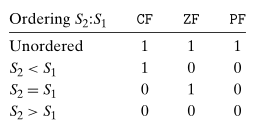

当出现无序的结果，可以使用指令`jp`（jump on parity）来进行跳转，而其他结果和无符号数的比较相同。

## x86-64内存分布

真实物理内存通过操作系统将其映射**虚拟内存**，从程序员的角度，内存就被抽象为一个很大的字节数组，每个元素是一个字节。在86-64机器上，64位二进制数为该数组地址进行编码，意味着64位操作系统最大能容纳$2^{64}$字节的内存大小，目前市面上该大小的内存还不是很普及。现在64位机器会限制只使用47位的地址，这也能支持$2^{47}$字节，即128T的内存大小。只使用47位编码时，最小地址为`0x0`，而最大的地址为`0x00007FFFFFFFFFFF`。

虚拟内存存储数据分不同区域：

- **Stack：**在Linux中，将栈放置在整个地址空间的最顶部，用于函数调用，及**局部变量**的存储，这样随着函数的运行，栈顶就能向低地址不断扩展。常用系统中栈的大小是8MB，可通过命令`limit`查看，如果用栈指针访问超过8MB范围的地址，就会出现**段错误（Segmentation Fault）**。 相同程序的栈的分配是固定的。
- **Shared Libraries：**类似于`printf`和`malloc`的这类**库函数**平时是被存储在磁盘上的，当我们程序需要使用库函数时，就会在程序开始执行时，将它们加载到你的程序中，这称为**动态加载（Dynamic Linking**）。
- **Heap：**用来存放通过**`malloc`、`callc`或`new`**等申请的变量，这些变量在程序运行时会动态变化。当你不断通过`malloc`申请空间又没释放时，堆顶的指针就不会断向高地址增加，使得占用的内存不断变多。堆在分配时是具有随机性的。
- **Data：**该数据区用来存放程序开始时分配的数据，你声明的**全局变量、静态变量或字符常量等**都在这个数据段中。
- **Text：**根据可执行目标文件的内容进行初始化，是放置你的**可执行程序**的位置。这部分区域是只读的。

## 理解指针

1. 指针对应一种类型。
2. 指针都有一个值。
3. 指针由`&`运算符创建。
4. `*`运算符用来间接引用指针。
5. 数组与指针联系很近。
6. 指针的强制类型转换只改变其类型，不改变值，换句话说便是，换一种对内存的读取方式。
7. 指针可以指向函数，函数指针的值即为函数机器代码中第一条指令的地址。

## 缓冲区溢出

数据栈中保存着函数的返回地址、“被调用者保存寄存器”以及局部变量等其他信息。C语言声明的数组也保存在栈的局部变量区，并且C语言不会对数组的引用进行任何边界检查，使得我们可以超出数组的边界对栈中的其他数据进行修改，此时程序就会出现很严重的问题。

这种破坏方法称为**缓冲区溢出（Buffer Overflow）**，比如现在栈中分配一个字符数组用来保存字符串，然后输入的字符串超出了数组分配的空间。

出现缓冲区溢出问题的主要原因是那些存储字符串的库函数，不会进行边界检查，比如`strcpy`、`strcat`和`gets`等等，这样就能输入超过缓冲区大小的字符串来进行攻击。通过这种缓冲区溢出攻击，可以输入一些可执行代码的字节编码，或者覆盖返回地址，使得`ret`指令会跳转到攻击者指定的代码。

### 对抗缓冲区溢出攻击

#### 不使用具有缓冲溢出的函数

我们在编写代码时可以写的更安全，比如使用`fgets`代替`gets`，因为`fgets`有一个用来指定程序最多可以读取多少字节的参数， 如果输入的字节超过这个数字，就会对其进行截断。同样可以使用`strncpy`代替`strcpy`。要注意不要直接使用`scanf`的`%s`来读取字符串，要么使用`fgets`代替，要么使用`%ns`来指定最多可以输入多长的字符串。

这些方法可以保护代码不会受到缓冲区溢出的攻击，并且现在已经开发出了可以帮助我们跟踪这些问题的工具了。

#### 地址空间布局随机化

为了在系统中插入攻击代码，攻击者不仅要插入攻击代码，还要插入指向这段攻击代码的指针，所以需要知道代码放置的位置。对此，可以使用**地址空间布局随机化（Address-Space Layout Randomization，ASLR）**技术，每次运行程序时程序的不同部分，包括程序代码、库代码、栈、全局变量和堆数据都会加载到内存的不同区域，使得代码位置不是很好获得。对应的破解方法是使用**空操作雪橇（Nop Sled）**，通过在攻击代码前插入一段很长的`nop`指令，当运行到`nop`指令时，就会“滑到”最终的攻击代码位置，通过枚举不同的起始地址，然后执行这段攻击代码，就能成功，只是效率可能会有点低。

ASLR中有一种**栈随机化**技术，每次程序运行时，在栈中分配一段0~n字节的随机大小空间，就能使得栈的位置在程序每次运行时都有变化。

我们每次会在栈中申请一段随机的空间，使得栈的位置发生变化。由于我们注入的代码需要修改返回地址来指向缓冲区的位置，但是每次地址都是变化的，就无法确定要如何修改返回地址。

#### 限制可执行代码区域

我们上面注入的形式，使得要执行的代码跑到了栈上，但是内存布局中，可执行代码应该位于Text区域。所以在原始的x86上，每个内存区域都有一个标记位，来表示该区域属于哪种类型，包括：**可写、可读**（等价于可执行）。在过去的10年左右，首先是AMD，然后是Intel，添加了第三种标志：**可执行**。所以我们可以简单地标记栈是不可执行的，就能防止通过修改返回地址，返回到栈上执行注入代码。

#### 栈破坏检测

缓冲区溢出攻击通常在缓冲区溢出时发生，所以当我们能够检测到什么时候发生缓冲区溢出，就能终止该程序。

GCC首先会尝试确定一个函数是否容易受到栈溢出攻击，比如函数中有局部char类型缓冲区时，就会使用一种**栈保护者（Stack Protector）机制**，通过在该函数栈帧中的局部变量区与栈状态（返回地址和寄存器保存区）之间存入一个随机的**金丝雀值（Canary）**，然后在恢复寄存器状态和返回返回地址之前，会检测该值是否发生变化，如果发生变化，则程序异常终止。

**技巧：**将缓冲区放在靠近金丝雀值的位置，防止其他局部变量被修改。

## ROP攻击

针对上述的3个系统提供的防御措施：栈随机化、限制可执行代码区域以及插入金丝雀值，我们可以使用新的攻击方法**ROP攻击（Return-Oriented Programming Attacks）**来破解前两种防御措施。

ROP的**策略**是：即使我们不知道栈的位置在哪，但我们知道代码存在哪里，因为栈随机化并没有修改全局变量和代码本身的位置，我们就可以使用现有的可执行代码片段来拼凑出我们想要的整体代码。

**注意：**该方法无法克服金丝雀值，即只能输入缓冲区限制的字节数目。

步骤：

1. 在原本的代码中选取以`ret`结尾的代码块作为我们要使用的攻击代码。
2. 将上述代码块的地址依次存入栈中。
3. 篡改`%rbp`的值，使得释放栈帧时`%rsp`还指向当前栈顶，这样程序执行自己的`ret`指令后即会开始运行攻击代码了。

为什么这个是有效的呢？首先，程序执行一条`ret`时，会从栈顶获得返回地址，而当前栈顶处的返回地址为我们注入的代码片段地址，程序就会去执行我们指定的代码片段，因为我们要求代码片段都以`ret`结尾，使得执行完一个代码片段后，执行`ret`指令就会从栈中获得下一个代码片段的地址，然后继续去执行下一个代码片段，依次类推，最终就能完成所有攻击代码了。

## 支持变长栈帧

为了管理变长栈帧，x86-64代码使用`%rbp`作为**帧指针（Frame Pointer）**。进入函数时，先将其存入到“保存寄存器区”，然后将当前的栈指针`%rsp`的值赋予`%rbp`，则函数最后可直接通过将`%rbp`的值赋予`%rsp`就能释放变长的栈帧，并且通过“保存寄存器区”来重置`%rbp`的值。

下面举例：

```c
long vframe(long n, long idx, long *q) {
	long i;
	long *p[n];
	p[0] = &i;
	for (i = 1; i < n; i++)
		p[i] = q;
	return *p[idx];
}
```


1. 函数入口
2. 由于在变长栈帧中要使用`%rbp`作为初始地址，而且`%rbp`是“被调用者保存寄存器”，所以要先将其压入栈中保存原始值
3. 将当前的栈指针`%rsp`保存到`%rbp`中，用于后续的释放空间
4. 由于C代码中对`i`访问了地址，所以需要将`i`保存到内存中，所以申请了一段16个字节大小的内存空间，用于存放`i`
5. 用`%rax`保存`8n+22`
6. `$-16`的十六进制表示为`0xFFFFFFFFFFFFFFF0`，将它和`%rax`进行与操作，相当于将`8n+22`变为16的倍数，如果n是奇数，则为`8n+8`，如果n是偶数，则为`8n+16`。
7. 用`%rax`计算的值申请存储`p`的空间。这里涉及到了对齐操作，由于`p`中保存的元素都是8字节大小的指针，则要求整个存储该字节的整个空间大小是8的倍数，而通过5.中的计算，能够保证`%rax`是8的倍数。
8. 由于我们要找到8的倍数用来存储指针，这里需要对其进行舍入处理，使其能够向上舍入，这里计算的就是偏移量
9. 计算得到最近的8倍数，用来开始保存数组`p`

最后的`leave`指令，等价于

```asm
movq %rbp, %rsp #释放之前申请的变长栈帧
popq %rbp       #重置%rbp的值
```

所以变长栈帧的申请，会自动进行对齐操作，并且使用`%rbp`作为初始地址，在函数返回时释放存储空间。