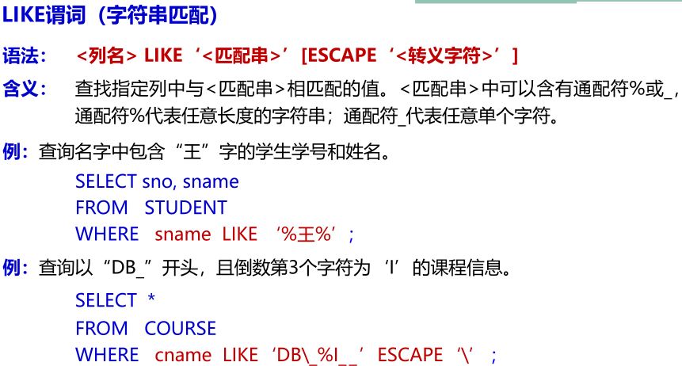
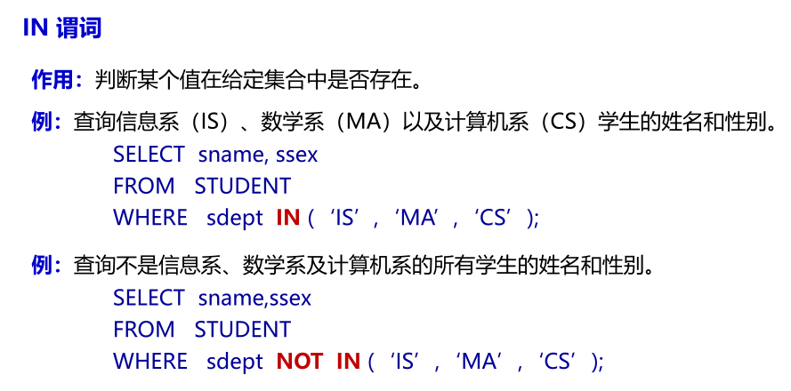
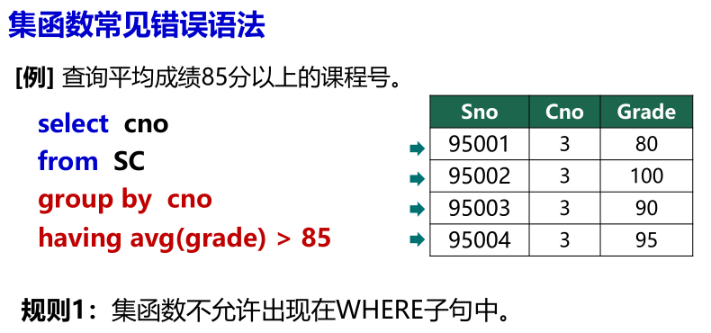
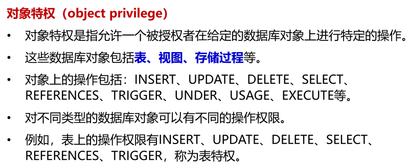
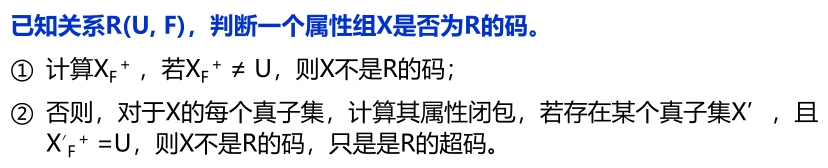

# 数据库

[TOC]

# 绪论

- 数据管理是指对数据进行分类、组织、编码、存储、检索和维护的技术。
- 数据管理经历了从人工管理阶段、文件系统阶段到数据库系统阶段的变迁。
  - 人工管理（1950前）
    - 计算机用于科学计算，硬件性能差，无磁盘，数据无法长期保存，无数据管理应用软件。
    - 数据不共享，应用程序高度依赖数据的逻辑结构和物理结构。
  - 文件系统（1950-1960）
    - 计算机广泛用于信息处理，有磁盘，数据可以长期保存，操作系统可以管理数据。
    - 用户程序与数据的物理存储结构分离，数据可在文件级共享。
    - 数据共享性差、数据冗余大、潜在数据不一致、程序与数据相互依赖、不能表示数据间的联系。
  - 数据库系统（1960至今）
    - 数据组织高度结构化，专门的管理软件DBMS，应用程序通过DBMS高效存取数据。
    - 数据共享性高，多个应用或用户可以共享数据；减少不必要的数据冗余；减少因重复存储带来的数据不一致性；便于扩展新的应用程序，扩充新的信息而不需要修改原有的应用程序。
    - 数据独立性强，包含物理独立性，即应用程序和数据物理存储方式相互独立，和逻辑独立性，即应用程序与数据逻辑结构相互独立，可以降低程序开发和维护的代价。
    - 数据结构化。
    - 数据保护机制完善，分四个方面：数据安全性，数据完整性，并发控制，故障恢复。
- 数据库系统DBS
  - 数据库系统是基于数据库的计算机应用系统，包含数据库、硬件、软件和用户。
    - 数据库DB
      - 长期存储在计算机内有组织的共享的数据集合。
      - 集成性与共享性。
    - 硬件
      - 存储和运行数据库系统的硬件设备。
      - 大容量内存、大容量外存、高数据传输能力。
    - 软件
      - DBMS、OS、应用程序、开发工具等
      - DBMS：数据定义；数据组织、存储和管理；数据操纵；数据库运行管理；数据库建立维护。
    - 用户
      - 终端用户、应用开发人员、数据库设计人员、数据库管理员DBA
- 数据模型
  - 分为概念模型和逻辑模型
  - 概念模型是将现实世界的事物抽象为信息世界的格式化信息
  - 逻辑模型是将信息世界的格式化信息数据化为具体的机器数据
- 概念模型
  - 实体：客观存在的可相互区别的事物
  - 属性：实体所具有的特性
  - 码：能唯一标识一个实体的属性或者属性集称为实体的码
  - 实体型：具有相同特征和性质的实体以及其属性命名序列
  - 实体值：实体型的具体实例
  - 实体集：同一类型实体值的集合
  - 联系：实体内部的联系和实体之间的联系，分为一对一、一对多、多对多。
    - 设有实体集A、B，若其中任何一个实体集中的任一实体至多与另一实体集中的1个实体有联系，则称A、B间存在一对一联系。
    - 设有实体集A、B，若A中的每一个实体可能与B中的n个实体（n≥0）有联系；反之，B中的每一个实体至多与A中的一个实体有联系，则称A、B间存在一对多联系。
    - 设有实体集A、B，若其中任何一个实体集中的任一实体均与另一实体集中的n个实体（n≥0）有联系，则称A、B间存在多对多联系。
    - 实体集之间的联系类型要根据具体的应用语义来判断。
- 逻辑模型（数据模型）
  - 数据结构：描述数据库的组成对象以及对象之间的联系
  - 数据操作：对数据库各种对象允许执行的操作的集合
  - 数据的约束条件：一组完整性规则，用以约束数据库的状态以及状态的变化，以保证数据的完整性。
  - 常用数据模型
    - 层次模型
      - 树形结构，节点表示实体，节点间用有向边表示实体间的联系，单父节点
      - 上下层节点之间的联系类型为一对多
      - 任何一个记录只有通过其层次路径查看时，才能显现其全部意义
      - 优点：结构简单，自然的一对多关系，查询效率相对高，良好数据完整性支持
      - 缺点：不能直接表示多对多联系或多实体间的复杂联系，仅允许自顶向下单向查询
    - 网状模型
      - 有向图结构，节点表示实体，节点间用命名有向边表示实体间的联系
      - 优点：直接描述复杂的联系，存取效率高
      - 缺点：复杂，数据独立性差
    - 关系模型
      - 二维表格结构，行为元组，列为属性
      - 关系表示实体和联系，行列次序无关，属性不可再分，关系至少含有一个码
      - 优点：结构简单，理论基础严密，数据独立性高，支持非过程化语言，一次操作可存取多个元组，可直接表示多对多联系
      - 缺点：查询效率低
    - 面向对象数据模型
    - 对象关系数据模型
    - 半结构化数据模型

- 三级模式结构
  - 模式：模式是对数据库中数据的结构和特征的描述，用来构造和解析数据。
  - 
  - 模式是数据库中全体数据的逻辑结构和特征的描述，即概念模式，又称用户共同视图，由多种记录类型构成，包含数据库的所有信息。
  - 外模式是数据库中局部数据的逻辑结构及其特征的说明，是模式的子集，又称子模式或用户模式。
  - 内模式是数据库在数据库系统内部的表示，描述数据的物理存储组织，又称存储模式或物理模式，支持用户建立适应需求的物理结构，如存取效率，空间效率，数据安全。
  - 三级模式的结构优点：数据独立性高，保证数据安全，简化用户接口，便于数据共享。
- 二级映像
  - 子模式/模式映像
    - 定义某一个外模式和模式之间的对应关系
    - 数据库中同一个模式可以有任意多个外模式，对应每一个外模式，都有一个子模式/模式映像
    - 模式改变时，该映像也会随之改变，保证外模式不变
    - 保证了数据的逻辑独立性
  - 模式/内模式映像
    - 定义数据的逻辑结构和物理结构之间的对应关系
    - 当数据库存储结构改变时，该映像必须随之修改，使得模式保持不变
    - 保证了数据的物理独立性
- 

# 关系模型

- 数据结构：数据库中全部数据及数据间联系都以关系来表示。
- 数据操作：增删查改
  - 操作符：选择、投影、连接、除、并、交、差
  - 理论基础：关系代数、元组关系演算、域关系演算
  - 具体实现：关系数据库语言（ALPHA、QBE、SQL）
- 数据约束条件：实体完整性、参照完整性、用户自定义完整性

## 关系数据结构

关系模型是建立在集合代数的基础上的，这里从集合论角度给出关系数据结构的形式化定义。

- 域（Domain）： 一组具有相同数据类型的值的集合，又称为值域。（一般用D表示）

- 基数：域中所包含的值的个数称为域的基数（用m表示）。

- 域用来表示关系中属性的取值范围。

- 笛卡尔积（Cartesian Product） 给定一组域$D_1,D_2,\ldots,D_n$，其笛卡尔积为：
  $$
  \mathrm{D}_{1} \times \mathrm{D}_{2} \times \ldots \times \mathrm{D}_{\mathrm{n}}=\left\{\left(\mathrm{d}_{1}, \mathrm{~d}_{2}, \ldots, \mathrm{d}_{\mathrm{n}}\right) \mid \mathrm{d}_{\mathrm{i}} \in \mathrm{D}_{\mathrm{i}}, \mathrm{i}=1, \ldots, \mathrm{n}\right\}
  $$

  - 由定义可以看出，笛卡尔积是一个集合。其中，笛卡尔积的每个元素$\left(\mathrm{d}_{1}, \mathrm{~d}_{2}, \ldots, \mathrm{d}_{\mathrm{n}}\right)$称作一个n-元组（n-tuple），或简称为元组（Tuple）。
  - 元组的每一个值$d_i$叫做一个分量（component）。

  若$D_i$的基数为$m_i$，则笛卡尔积的基数为$M=\prod_{i=1}^nm_i$。

- 关系（relation） 笛卡尔积$\mathrm{D}_{1} \times \mathrm{D}_{2} \times \ldots \times \mathrm{D}_{\mathrm{n}}$的子集叫做在域$D_1,D_2,\ldots,D_n$上的关系，用$R(D_1,D_2,\ldots,D_n)$表示。

  - $R$为关系的名字，$n$为关系的度或目。
  - 关系中每一个元素也称作元组，用$t$表示。
  - 关系可以表示为二维表的形式。表的每一行对应一个元组，每一列对应一个域，由于域可以相同，为了加以区分，必须对每列起一个名字，称为属性(attribute)。n目关系必有n个属性。
  - 在实际应用中关系是笛卡尔积中所取的有意义的子集。
  - 关系是规范化的二维表中行的集合，为了使相应的数据操作简化，在关系模型中对关系作了种种限制。关系具有如下特性：
    1. 列是同质的
    2. 不同的属性，属性名不能相同
    3. 行、列的顺序无关紧要
    4. 任意两个元组不能完全相同
    5. 每一分量必须是不可再分的数据

- 关系模式 关系的描述称作关系模式，包括关系名、关系中的属性名、属性向域的映象、属性间的数据依赖关系等，记作 $R (U，D，DOM，F)$。
  - 其中：
    - $R$：关系名
    - $U$：R中的属性名序列
    - $D$：域（取值范围）
    - $DOM$：属性到域的映象集
    - $F$：属性间数据的依赖关系集合
  - 关系模式也可简记为 $R(U)$ 或$ R(A_1, A_2, \ldots, A_n)$
  - 关系是某一时刻对应某个关系模式的内容，关系模式是关系的定义。

## 关系的完整性约束

- 候选码（Candidate Key）关系中的一个属性组，其值能唯一标识一个元组，若从属性组中去掉任何一个属性，它就不具有这一性质了，这样的属性组称作候选码。
- 主码（Primary Key）进行数据库设计时，从一个关系的多个候选码中选定一个作为主码。主码也称为主关键字、关键字、主键等。
- 主码是关系模型中的重要概念。每个关系必须选择一个主码，选定以后不能随意改变。每个关系必定有且仅有一个主码，通常用较小的属性组合作为主码。
- 外码（Foreign Key）关系R中的一个属性组，它与另一个关系S的主码相对应，称这个属性组为R的外码（或外关键字、外键），并称R为参照关系（referencing relation）、S为被参照关系（referenced relation）。

### 实体完整性

在关系中的所有元组在主码上的取值满足以下条件，则说该关系具有实体完整性：

- 主属性非空——若属性A是基本关系R的主属性，则属性A不能取空值（不知道或无意义，记为NULL）。
- 主码各不相同——不会出现主码相同的两个记录。

关系对应现实世界中的实体集，元组对应实体。实体是相互可区分的，通过主码来唯一标识，若主码不唯一或者为空，则出现不可标识的实体，这是不容许的。

### 参照完整性

如果关系$R_2$的外码$F$与关系$R_1$的主码$P $相对应，则$R_2$中的每一个元组在$F$上的取值：

- 或者为空值
- 或者等于$R_1$中某个元组的$P$值

如果关系$R_2$的某个元组$t_2$参照了关系$R_1$的某个元组$t_1$，则$t_1$必须存在。

### 用户定义的完整性

用户针对具体的应用环境定义的完整性约束条件。反映某一具体应用所涉及的数据必须满足的语义要求，以便用统一的、系统的方法处理它们，而不需要由应用程序来承担这一功能。

## 关系代数

关系代数是将关系作为运算单位（操作数），用关系代数表达式表示的运算方法。运算对象和运算结果都是关系。关系操作按运算符的不同主要分为两类：传统的集合运算与专门的关系运算。

传统的集合运算都是二目运算，要求参加运算的关系必须具备相容性（除去笛卡尔积），即对于给定的两个关系R、S，要求满足，R和S具有相同的度n，且R 中的第 i 个属性和 S 中的第 i 个属性来自同一个域。

- 并
- 差
- 交
- 笛卡尔积：结果是一个目为 r＋s 的元组集合，其中每条元组的前 r 个分量来自 R 的一个元组，后 s 个分量来自 S 的一个元组，若 R 有 m 个元组，S 有 n 个元组，则 R×S 的基数为 m×n。

传统集合运算的粒度太粗，要实现对关系数据库的灵活查询需要引入钻们的关系运算。

- 投影：$\Pi_{A}(R)=\{t[A] \mid t \in R\}$，投影运算是从关系R中选取若干属性列，构成结果关系，其中A为要选的属性列序列，可用列的属性名或列的序号表示。
  - 单目运算
  - 从列的角度进行运算
  - 投影的列可以按照需要排序
- 选择：$\sigma_{\mathrm{F}}(\mathrm{R})=\{\mathrm{t} \mid \mathrm{t} \in \mathrm{R} \wedge \mathrm{F}(\mathrm{t})= TRUE \}$，其中F为条件表达式，选择运算是从关系R中选取满足给定条件的元组，构成结果关系。
  - 运算对象：属性（属性名或带方括号的列号），常数（如数字）
  - 运算符：比较运算符（ >，≥，=，<，≤，≠ ），逻辑运算符（∧，∨，┐）
- 连接：连接运算是从两个关系的笛卡尔积中选取满足连接条件的元组，构成结果关系。$R\underset{A\theta B}{\bowtie}S$，A和B分别为R和S上度数相等且可比的属性组，$\theta$是比较运算符。
  - 先求笛卡尔积，再选择满足条件的元组。
  - 双目运算，不需要有公共属性
  - 当比较运算为等于时，称为等值连接
  - 结果关系中不删除重复属性
- 自然连接：$R\bowtie S$
  - 先求笛卡尔积，接着设R与S之间的公共属性为$A_1,A_2,\ldots,A_k$，选择笛卡尔积的结果中满足$R.A_1=S.A_1,\ldots,R.A_k=S.A_k$的元组，最后去掉公共属性。
  - 结果表示：$\mathrm{R} \bowtie \mathrm{S}=\Pi_{\mathrm{i_1}, \ldots, \mathrm{i_m}}\left(\sigma_{\mathrm{R} . \mathrm{A_1} =\mathrm{S} . \mathrm{A_1} \wedge R \cdot \mathrm{A_2}=S . \mathrm{A_2} \ldots \wedge \mathrm{R} . \mathrm{A_k}=\mathrm{S} . \mathrm{A_k}}(\mathrm{R} \times \mathrm{S})\right)$。
  - 自然连接中做等值比较的分量必须是相同的属性组。
  - 自然连接的结果中不含重复属性。
  - 当R与S无公共属性，则退化为笛卡尔积；当R与S全是公共属性，则退化为交。
- 除法：
  - 象集（Images Set）：已知关系模式$R(X, Y)$，$X、Y$为属性组，对于$R$的某个关系$A$和$A$中的一条
    元组$t$，设$t[X]=x$，则$x$在$A$中的象集记为$Y_x=\{t[Y] \mid t \in A \wedge t[X]=x\}$。
  - 已知关系$ R(X,Y) $和$ S(Y)$， $X、Y$为属性组，$R$和$S$的元数分别为$ r $和$ s$，则$ R÷S $的结果$ T $是一个$（r－s）$元的关系。$T$是满足下列条件的最大关系：$T$中每个元组 $t$ 与$ S $中的每个元组$ u $组成的新元组$ <t, u>$一定在关系$ R $中，即$R \div S=\left\{t[X] \mid t[X]=x, t \in R \wedge S \subseteq Y_{x}\right\}$。
  - 

五种基本运算：并、差、笛卡尔积、投影、选择，其余运算可以用基本运算来表达。

关系代数中，这些运算经有限次复合后形成的式子称为关系代数表达式。


# SQL

- 一体化：数据查询、数据定义、数据操纵、数据控制
- 接近自然语言
- 非过程语言
- 面向集合：每个命令的操作对象是一个或多个关系，结果也是一个关系。

- 

## 数据定义

```sql
create schema 模式名 [authorization 用户名]

create table 表名(
	列名 数据类型 [default 缺省值] [NOT NULL]
    [, 列名 数据类型 [default 缺省值] [NOT NULL] ...]
    [, primary key (列名 [, 列名] ...)]
    [, foreign key (列名 [, 列名] ...) references 表名(列名 [, 列名] ...)]
    [, check(条件表达式)]
)

drop table 表名 [cascade | restrict]

alter table 表名 表修改子句
```


- 缺省为RESTRICT，此时数据库中不应该存在依赖于被删除表的其它表、视图、索引、存储过程等对象。
- 撤消基本表后，基本表的定义、表中的数据、表上的约束、索引、视图、触发器等都将被删除。

- 表修改子句的语法不属于核心SQL，不同的DBMS可能支持不同的语法。

## 数据查询

### 单表查询

```sql
SELECT <列名或表达式序列>
FROM <基本表名或视图名序列>
[WHERE <行条件表达式>]
[GROUP BY <列名序列>
[HAVING <组条件表达式>] ]
[ORDER BY <排序列名>[ASC|DESC] [, …]]
```

- SELECT 语句的执行过程 
  - 读取FROM子句中基本表及视图的数据，并执行笛卡尔积操作；
  - 选取其中满足WHERE子句中条件表达式的元组；
  - 按GROUP BY子句中指定列的值分组；
  - 提取满足HAVING子句中组条件表达式的那些分组；
  - 按ORDER BY子句进行排序；
  - 按SELECT子句投影出结果关系。











### 连接查询


### 嵌套查询

- 一个SELECT-FROM-WHERE语句称为一个查询块，将一个查询块嵌套在另一个查询块中的查询称为嵌套查询。其中，外层的查询块称为父查询，内层的查询块称为子查询。

- 当子查询的返回结果可能为多个值时，应使用IN谓词来表示一个值是否存在于某个集合中。

- 
- 

- 
- SQL语言中没有全称量词$\forall$，但总可以把带有全称量词的命题转换为等价的带有存在量词的命题。
- 

### 集合查询


### 派生表查询


## 数据操纵

### 数据插入

```sql
INSERT INTO <表名> [(<列名序列>)] VALUES (<元组值>)
```

### 数据删除

```sql
DELETE FROM <表名> [WHERE <条件表达式>]
```

### 数据修改

```sql
UPDATE <表名>
SET <列名>＝<值表达式> [,<列名>＝<值表达式>…]
[WHERE <条件表达式>]
```

## 视图

```sql
CREATE VIEW <视图名> [(<列名序列>)]
AS <子查询>
[WITH CHECK OPTION]

DROP VIEW <视图名>
```

- 视图是从一个或几个基本表（或视图）导出的一个虚表。
- 数据库中只存放视图的定义而不存放视图的数据，数据只存放在基表中。
- 当基表中的数据发生变化时，从视图中查出的数据也会随之改变

- `with check option`表示更新视图时所影响的元组必须满足视图定义子查询中的WHERE条件。

- 视图删除后，只会删除该视图在数据字典中的定义，而与该视图有关的基本表中的数据不会受任何影响。
- 对视图的查询与对表的查询完全一样。
- 视图的更新操作语法与基表一样，包括插入、修改和删除操作。对视图的更新，最终实际上是转换成对基表的更新。
- 
- 视图能够提供数据独立性，用户能以多种角度看待同一数据，简化用户的操作，是数据共享和保密的一种安全机制。

## 索引

```sql
CREATE [CLUSTER] [UNIQUE | BITMAP] INDEX <索引名>
ON <表名> (<列名> [, <列名>…])

DROP INDEX <索引名>
```

- 索引（index）是与某个基表的属性（组）A相关的数据对象，当需要通过A的值查找表中的元组时，它可以提高查找效率。
- 如：在STUDENT表的Sno属性上建索引，则数据库中会增加一个对用户不可见的数据表，其中每条记录的格式为：（Sno，Sno对应的学生记录的地址）
- 基表上可建多个索引，DBMS会自动选择合适的索引进行检索。当表中的数据更新时 ，DBMS自动更新索引。
- 索引属于三级模式中物理模式的范畴。
- 可以随时建立和删除索引。
- 用户在数据操作中不允许使用索引，索引的维护和使用完全由系统自动决定，这支持了数据的物理独立性。
- 应该在查询频率高的、经常用于连接的列上建索引；索引可以提高查询效率，但过多或不当的索引会耗费存储空间，且降低插入、删除、更新的效率。

# 数据库安全性

- 数据库的安全性是指保护数据库以防止不合法的使用所造成的数据泄露、更改或破坏。数据库系统中大量数据集中存放，多用户直接共享。系统的安全保护措施是否有效是数据库系统的主要性能指标之一。
- 技术安全、管理安全、政策法律类安全问题
- 
- 

## 数据库安全控制技术

### 用户标识和鉴别

系统提供一定的方式让用户标识自己的名字和身份，系统进行核实，通过鉴定后才提供系统使用权。

静态口令、动态口令、生物特征鉴别、智能卡、多种混合鉴别方式。

### 存取控制

对于获得上机权的用户，还要根据系统预先定义好的外模式（视图）或用户权限进行存取控制，保证用户只能存取其有权存取的数据。

定义用户权限、用户权限检查。

#### 自主存取控制

自主存取控制（ Discretionary Access Control ， 简 称 DAC ） 在TCSEC/TDI安全级别中处于C级。是由用户定义存取权限的一种控制策略。目前SQL标准对DAC提供支持，通过GRANT和REVOKE命令实现。




```sql
GRANT <特权> [[,<特权>]…]
ON <对象类型> <对象名>
TO <用户> | PUBLIC [[,<用户> | PUBLIC ]…]
[WITH GRANT OPTION]

REVOKE <特权> [[,<特权>]…]
ON <对象类型> <对象名>
FROM <用户> | PUBLIC [[,<用户> | PUBLIC] …]
[CASCADE｜RESTRICT]

CREATE ROLE <角色名>

GRANT <权限>[,<权限>...]
ON <对象类型> <对象名>
TO <角色>[, <角色>...]

GRANT <角色>[,<角色>...]
TO <用户>[, <角色>...]
[WITH ADMIN OPTION] //表示该权限是否可转授给其他角色

REVOKE <权限> [, <权限>...]
ON <对象类型> <对象名>
FROM <角色> [, <角色>...]
```

- PULBIC代表数据库中的全部用户。
- WITH GRANT OPTION为可选项，表示允许被授权的用户将该特权再授予其他用户。

- 数据库角色是被命名的一组权限的集合。角色一般用于简化对一组相同权限的用户的授权。
- 自主存取控制的缺陷：用户可以自由地决定将数据的存取权限授予任何人、决定是否将“授权”的权限授予别人，而系统对此无法控制。

#### 强制存取控制

强制存取控制（Mandatory Access Control ，简称MAC）是为保证更高程度的安全性，按照TDI/TCSEC标准中的安全策略的要求，所采取强制的存取检查手段。MAC在标准中处于B级。它不是用户能直接感知或进行控制的。适用于对数据有严格而固定的密级分类的部门。

- 实体类别
  - 主体：系统中的活动实体，包括用户和用户的进程。
  - 客体：系统中的被动实体，受主体操纵的基表、索引、视图等。
- 敏感度标记
  - 主体敏感度标记：许可证级别（Clearance Level）
  - 客体敏感度标记：密级（Classification Level），如：绝密（Top Secret）、机密（Secret）、可信（Confidential）、公开（Public）
- 存取规则
  - 当某一用户（主体）以某一许可证标记进入系统后，系统要求他对任何客体
    的存取必须遵循如下规则：
    - 仅当主体的许可证级别大于等于客体的密级时，该主体才能读相应客体；
    - 仅当主体的许可证级别小于等于客体的密级时，该主体才能写相应客体。
- 优点
  - 防止数据从高密级向低密级流动，避免敏感数据的泄露；
  - 对数据本身进行密级标记，无论数据如何复制，标记与数据作为不可分割的整体存在。

- 兼容关系
  - 安全级别之间具有偏序向下兼容关系，较高安全性级别的安全保护措施要包含较低级别的所有保护措施，同时应提供更多更完善的保护能力。因此实现MAC必须先实现DAC，DAC和MAC共同构成DBMS的安全机制。
  - 

### 视图机制

- 对安全级别要求较高的数据一般通过视图进行访问，从而避免用户直接访问基表中其他数据。
- 通过视图隔离，用户只能看到与自己相关的数据，其它与该用户无关的数据被视图隔离或屏蔽了。
- 视图可以帮助实现基表上更细粒度的自主访问控制。

### 审计机制

- 对用户使用系统资源情况的登记和审查。
- 由DBMS提供专门的命令或工具，在DBMS运行时自动登记审计日志（Audit Log），进一步控制具有操作权的用户。“审计”功能是标准TDI/TCSEC中C2以上安全级别必不可少的一项指标。（防抵赖）
  - 用户级：对数据库对象上发生的操作进行审计
  - 系统级：对登录、权限授予及回收等操作进行审计
- 审计会导致较大的系统开销。

### 数据加密


### 其他

- 推理控制——避免利用背景知识或数据间约束关系推导出敏感数据。

- 隐蔽信道——避免利用SQL语句执行的反馈信息传递敏感数据

- 隐私保护——避免公开发布的数据泄露个人隐私。

# 数据库完整性

完整性是指数据的正确性和相容性。正确性指数据库中数据与现实世界的实际情况是相符的。相容性指数据库中数据自身不存在自相矛盾的现象。

- 完整性控制功能
  - 为用户提供定义完整性约束条件的机制，DBMS将这些约束条件作为模式的一部分存入数据库中。
  - 监督系统中执行的操作是否违反完整性限制条件，应进行完整性检查的操作有INSERT/DELETE/UPDATE。
  - 对违反完整性约束的情况进行相应处理，如拒绝执行 / 级联操作
- 类型
  - 实体完整性
  - 参照完整性
  - 用户定义的完整性

## 实体完整性

- 实体是客观存在且互相区别的事物。

- 实体完整性在关系模型中通过关系的主码（PRIMARY KEY）来体现。PRIMARY KEY在CREATE TABLE语句中定义。

- SQL允许在定义表的时候不声明表的主码，但是不允许声明一个以上的主码！
- 对基表插入数据或对主码列进行更新时，DBMS将自动对该操作进行实体完整性检查。
  - 各主码列的值是否为空，是则拒绝执行该操作
  - 主码值是否唯一，否则拒绝执行该操作

## 参照完整性

- 引用数据与被引用数据应该是一致的。
- 参照完整性在关系模型中通过关系的外码（FOREIGN KEY）来体现。FOREIGN KEY同样在CREATE TABLE语句中定义。
- 在参照完整性约束中，参照关系（即外码所在的关系，如SC），称为子表；被参照关系（如STUDENT和COURSE）称为父表。

- 外码的取值限制：或者为NULL，或者引用父表中的某值。
- 在子表中插入元组仅当父表中存在与插入元组相应的元组时，系统执行在子表中插入元组的操作，否则拒绝执行此插入操作。
- 修改子表外码，如果父表中存在待修改值，则执行；否则拒绝执行此修改操作。
- 修改父表主码（若子表中有相关参照记录）
  - 拒绝修改，拒绝执行此类操作。
  - 级联修改，将子表中相关记录在外码上的值一起自动修改。
  - 置空修改，将子表中相关记录在外码上的值全部置为NULL。

- 删除父表元组（若子表中有相关参照记录）
  - 拒绝删除，发出警告，拒绝执行此类操作。
  - 级联删除，删除父表元组的同时，自动删除子表中的相关元组。
  - 置空删除，删除父表元组的同时，自动将子表中的相关元组的外码置NULL值。

- 在定义参照完整性约束时，可同时指定删除或修改时的违约处理动作，如NOT ACTION、SET NULL 或 CASCADE。缺省动作为NOT ACTION。

## 用户定义完整性

- 在一个具体应用中，数据需满足一些特定的语义要求。
  - 空值约束（列级）指定属性的值不允许为空值（NOT NULL）
  - 唯一性约束（列级/表级）指定属性或属性组的值必须唯一（UNIQUE）
  - CHECK约束（列级/表级）检查一个属性或一个元组的取值是否满足一个布尔表达式。

## 完整性约束命名子句

- 完整性约束与列一样是关系模式的构成元素。关系中的列是必须命名的，但是约束却不一定要命名。

- ```sql
  CONSTRAINT <约束名> <约束说明>
  ```

- 其中，<约束说明> 可以是PRIMARY KEY子句，FOREING KEY 子句，NOT NULL子句，UNIQUE子句和CHECK子句。

## 断言

断言是完整性约束的一个特殊类型。一个断言可以对基本表的一个属性、一条元组、或整个基本表定义有效值集合，或定义存在于多个基本表中的有效值集合。

```sql
CREATE ASSERTION ＜断言名＞ CHECK (＜约束搜索条件＞)
```

## 触发器

- 触发器是定义在基表上的一种数据库对象，它指定：在执行对表的某些操作的时候，另一些操作也同时被执行。

- 定义一个触发器应包含的要素：

  - 名字
  - 关联的表名
  - 触发事件（`INSERT`、`DELETE`、`UPDATE`）
  - 触发动作
  - 触发时机（`BEFORE`，`AFTER`）

  ```sql
  CREATE TRIGGER <触发器名>
  [BEFORE | AFTER] <触发事件> ON <表名>
  FOR EACH {ROW | STATEMENT}
  [WHEN <触发条件>]
  <触发动作体>
  
  DROP TRIGGER <触发器名>
  ```

- `FOR EACH ROW`表示该触发器为行级触发器，触发事件每影响一条元组都将激活一次触发器。
- `FOR EACH STATEMENT`表示该触发器为语句级触发器，触发事件只激活一次触发器。

- 触发器被激活后，先检查<触发条件>，当其为真时，<触发动作体>才执行；如果没有指定<触发条件>，则<触发动作体>在触发器被激活后立即执行。
- <触发动作体>是一段程序，可以使用NEW和OLD分别引用触发事件发生前后的元组值。
- 用户只能定义、但不能执行触发器。触发器由DBMS自动执行。
- DBMS按如下顺序执行操作：BEFORE触发器->触发事件->AFTER触发器
- 任一触发器的执行失败都将中止整个操作。

# 关系数据理论

- 关系模式中的异常问题：
  - 数据冗余
  - 更新异常
  - 插入异常
  - 删除异常
- 异常问题的原因在于关系模式中存在不合适的数据依赖

## 数据依赖

- 数据依赖是一个关系中的属性之间的某种语义约束关系。
- 常见的数据依赖有函数依赖和多值依赖。

### 函数依赖

- 设有关系模式$R(U，F)$，$X、Y$是$U$的子集，若$R$的任意两个元组只要在$X$上取值一致，则其在$Y$上的取值必定也一致，则称$X$函数决定$Y$，或者$Y$函数依赖于$X$，记为$X→Y$。

- 只能根据应用语义来确定一个函数依赖，但无法根据函数依赖的定义来证明。

- 属性间联系与函数依赖的对应关系
  - 一对一联系：存在函数依赖$X→Y$，且$ Y→X$
  - 一对多联系：存在函数依赖$Y→X$，但不存在$X→Y$
  - 多对一联系：存在函数依赖$X→Y$，但不存在$Y→X$
  - 多对多联系：不存在函数依赖
- 平凡函数依赖：若$X\rightarrow Y$，且$Y\subseteq X$，则称$X\rightarrow Y$是平凡函数依赖
- 非平凡函数依赖：若$X\rightarrow Y$，且$Y\not\subset X$，则称$X\rightarrow Y$是非平凡函数依赖
- 完全函数依赖：若$X\rightarrow Y$，且不存在$X$的任何真子集$X'$，使得$X'\rightarrow Y$成立，则称$Y$完全函数依赖于$X$，记作$X\overset{f}\rightarrow Y$。
- 部分函数依赖：若$X\rightarrow Y$，且存在$X$的真子集$X'$，使得$X'\rightarrow Y$成立，则称$Y$部分函数依赖于$X$，记作$X\overset{p}\rightarrow Y$。
- 传递函数依赖：若$X\rightarrow Y,Y\not\subset X,Y\rightarrow Z,Z\not\subset Y$，且有$Y\not\rightarrow X$，则称$Z$传递函数依赖于$X$，记作$X\overset{传递}\rightarrow Y$。

- 设有关系模式$R(U,F)$，$K\subset U$，若$K\overset{f}\rightarrow U$，则$K$为$R$的一个候选码，简称码。
  - 码为单属性，则称单属性码；码为多属性，则称多属性码；码为全部属性，则称全码。
  - 包含一个码的属性组，称为超码。
  - 包含在任何一个码中的属性，称为主属性。
  - 不包含在任何一个码中的属性，称为非主属性。

### 多值依赖

- 设有关系模式$R$，$X$和$Y$为属性集$U$的子集，$Z＝U－X－Y$，$r$为$R$的任一关系。若对于给定的一对$(x, z)$值，有一组$Y$的值，这组值仅仅决定于$x$，而与$z$值无关，则称$Y$多值依赖于$X$，或$X$多值决定$Y$，记作$X→→Y$。
- 若$Z=\empty$，则称$X\rightarrow \rightarrow Y$为平凡多值依赖，否则为非平凡多值依赖。
- 对称性：如果有$X\rightarrow\rightarrow Y$，则$X\rightarrow\rightarrow U-X-Y$。
- 若$X\rightarrow Y$，则$X\rightarrow\rightarrow Y$，反之未必成立。
- 设$XY\subseteq W\subseteq U$，若$X\rightarrow Y$在$W$上成立，则$X\rightarrow Y$在$U$上成立，对于多值依赖而言则不一定。
- 设$Y'\subseteq Y$，若$X\rightarrow Y$，则$X\rightarrow Y'$，对于多值依赖而言则不一定。

## 规范化

### 1NF

- 如果关系模式$R$的所有属性均为简单属性，即每个属性都是不可再分的，则称$R$属于第一范式（简称1NF）。

### 2NF

- 在1NF的基础上，每个非主属性都完全函数依赖于$R$的码，则称$R$属于第二范式（简称2NF）。

### 3NF

- 在1NF的基础上，不存在码$X$，属性组$Y$及非主属性$Z$（$Z\not\subset Y$）使得$X\rightarrow Y$（$Y\not\rightarrow X$），$Y\rightarrow Z$成立，则称$R$属于第三范式（简称3NF）。（非主属性对码的传递依赖或部份依赖）

- 如果一个关系模式是第三范式，则他也是第二范式。

### BCNF

- 在1NF的基础上，对于$R$中所有的非平凡函数依赖$X\rightarrow Y$，$X$都包含码，则称$R$属于BC范式（简称BCNF）。

- 如果一个关系模式是BC范式，则他也是第三范式。
- BCNF消除了所有非主属性对于候选码的不良函数依赖，消除了主属性对候选码的不良函数依赖。

### 4NF

- 在1NF的基础上，若对于$R$中存在的每一个非平凡多值依赖$X\rightarrow\rightarrow Y$（$Y\neq \empty,Y\not\subset X$），$X$都包含码，则称$R$属于第四范式（简称4NF）。
- 如果一个关系模式是第四范式，则他也是BC范式。


反规范化：在数据库中，为了提高查询效率而有意降低关系规范化程度的一种技术。

## Armstrong公理系统

- 公理系统：设有关系模式$R(U,F)$，$X,Y,Z\subseteq U$，则有
  - 若$Y\subseteq X$，则$X\rightarrow Y$。
  - 若$X\rightarrow Y$，则$XZ\rightarrow YZ$。
  - 若$X\rightarrow Y$，$Y\rightarrow Z$，则$X\rightarrow Z$。
- 推论
  - 若$X\rightarrow Y$，$X\rightarrow Z$，则$X\rightarrow YZ$。
  - 若$X\rightarrow YZ$，则$X\rightarrow Y$，$X\rightarrow Z$。
  - 若$X\rightarrow Y$，$YW\rightarrow Z$，则$XW\rightarrow Z$。
- 逻辑蕴含：设$F$是关系模式$R$的一个函数依赖集，$X,Y$是$R$的属性子集，如果能从$F$中的函数依赖推导出$X\rightarrow Y$，则称$F$逻辑蕴含$X\rightarrow Y$。
- 闭包：被$F$所逻辑蕴含的函数依赖全体所构成的集合称作是$F$的闭包，记作$F^+$。
  - 一般来说$F\subseteq F^+$，若$F=F^+$，则称$F$是函数依赖的完备集。
- 属性闭包：设关系模式$R(U,F)$，$U=\left\{A_{1}, \quad A_{2}, \ldots, A_{n}\right\}, X \subseteq U$，$F$是$U$上的一个函数依赖集，则称所有用Armstrong公理从$F$推导出的函数依赖$X\rightarrow A_i$中所有的$A_i$的属性集合为属性集$X$关于$F$的闭包，记作$X_{F^+}$。
  - $\mathbf{X} \rightarrow \mathbf{Y} \in \mathbf{F}^{+} \Leftrightarrow \mathbf{Y} \subseteq \mathbf{X}_{\mathbf{F}}{ }^{+}$
  - 这个定理的意思就是逻辑蕴含和右部属性属于左部属性闭包是等价的。
- 函数依赖集等价：设$F$和$G$是关系模式$R$的两个函数依赖集，如果$F^+=G^+$，则称二者等价。其充要条件为$F\subseteq G^+,G\subseteq F^+$。
- 最小函数依赖集：若函数依赖$F$满足如下条件，则称$F$为一个最小函数依赖集：
  - $F$中每个函数依赖的右部都是单属性。
  - 对于$F$中的任意函数依赖$X\rightarrow A$，$F-\{X\rightarrow A\}$与$F$都不是等价的。
  - 对于$F$中的任意函数依赖$X\rightarrow A$，不存在$X$的真子集$Z$，使得$F$与$(F-\{X\rightarrow A\})\cup\{Z\rightarrow A\}$等价。
- 模式分解：设有关系模式$R(U,F)$，称$\rho=\left\{R_{1}\left(U_{1}, F_{1}\right), R_{2}\left(U_{2}, F_{2}\right), \ldots, R_{n}\left(U_{n}, F_{n}\right)\right\}$为$R$的一个分解，其中：
  - $U=U_1\cup U_2\cup U\cup\ldots\cup U_n$
  - 不允许$U_i\subseteq U_j$
  - $F_i$是$F$在$U_i$上的投影
- 函数依赖的投影：函数依赖集合$F_i=\left\{X \rightarrow Y \mid X \rightarrow Y \in F^{+} \wedge X Y \subseteq U_{i}\right\}$称为在$U_i$上的投影，其满足只包含$U_i$中的属性，且由$F$推导而来。
- 分解的正确性标准
  - 无损连接性：分解所得到的各个关系模式，经过自然连接可以还原成被分解的关系模式。
  - 依赖保持性：分解所得到的各个关系模式上的函数依赖集的并集，与被分解关系模式原有的函数依赖集等价。分解具有依赖保持性的充分条件是F中的每个函数依赖都在分解后的某个$R_i$上成立。

### 计算属性闭包的算法

实际上就是给定左部，寻找能够推出的属性集合，多次循环的意义在于消除传递依赖。


### 判断码

码的定义在于能够推出整个属性全集且是最小的，因此要验证属性组的所有真子集



### 求所有候选码

先找未出现在右部的属性集，进行判断，因为它们不能够被别的属性推出，如果它们合起来是码，那就不用再找了。如果不是，则再找左右都出现过的属性集，和之前的不能被推出的属性集合并判断，如果是码的话，那就记录。同时还要注意，要判断组合出来的属性集是不能包含当前已经找到的码，因为这样找到的就是超码，而不是码。


### 判断函数依赖集直接的等价

注意这里是求对方函数依赖集的属性闭包。


### 求最小函数依赖集

求最小函数依赖集的步骤就是最小函数依赖集的三个定义。

注意要反复使用2和3，因为存在新的左部属性组。


### 计算投影


### 判断无损连接性


# 数据库设计


- ER图


- 设计局部ER模型
- 设计全局ER模型
  - 合并局部ER图，消除冲突
    - 属性冲突
    - 命名冲突
    - 结构冲突
  - 消除不必要冗余，生成基本ER图


- 设计初始关系模式
  - ER图向关系模式的转换
    - 实体：一个实体转换为一个关系，关系的属性就是实体的属性，关系的码就是实体的码
    - 联系：一个联系转换为一个关系，关系的属性是与该联系相连的各个实体的码加上联系自身的属性
      - 
  - 消化联系关系
    - 码相同的关系可以合并称一个关系
  - 自联系转换
    - 实体转化为一个关系
    - 联系转化为一个关系
    - 消化联系关系
    - 确定外码
- 关系模式优化
  - 应用规范化理论对关系模式进行规范化，以减少乃至消除关系模式中存在的各种异常，改善完整性、一致性和存储效率。
  - 必要时进行反规范化设计，以提高查询效率。
  - 根据应用的特点，对关系模式进行垂直分解和水平分解，以提高操作效率和存储空间利用率。
  - 水平分解是把关系中的元组分解为若干个子集。对于经常进行大量数据的分类条件查询的关系，可进行水平分解，这样可以减少每次查询需要访问的元组数。
  - 垂直分解是把关系模式的属性分解为若干个子集。

- 设计子模式
  - 使用更符合用户习惯的别名、计量单位等
  - 从安全性出发，对不同级别的用户定义不同的视图
  - 从易用性出发，将复杂查询语句定义为视图

- 物理结构
  - 
  - 索引
    - 索引是与基表的属性（组）相关的数据对象，能够提供对基表数据的快速访问。同一基表上可建多个索引，执行查询语句时，DBMS自动选择合适的索引访问数据。当表中的数据更新时，DBMS自动更新索引。数据越多，索引的优势越明显。索引可以提高查询效率，但是增加了空间开销以及维护的代价。
    - B+树：等值查询，范围查询，聚集函数计算，排序，遍历
    - Hash索引：等值查询，等值连接
    - 位图索引：基数较小的列，静态数据
  - 聚簇
    - 为了提高查询速度，把在某个属性（组）上具有相同值的元组集中地存放在相邻的物理块中。该属性（组）称为聚簇码。
    - 单表聚簇：将单个表的数据按聚簇码分组有序的存储。最常用于等值比较的属性，且该属性上的重复取值较多。
    - 多表聚簇：把多个表的数据按聚簇码集中存储在一起。经常进行连接操作的表可以建立聚簇。
    - 一个表最多只能属于一个聚簇。聚簇维护开销很大。频繁更新的属性不适合作为聚簇码。
  - 
  - 

# 数据库事务

- 事务

  - 事务是用户定义的一组数据库操作，这组操作要么都做，要么都不做，不可分割 。

  - 事务处理机制——基于事务的故障恢复机制和并发控制机制。

  - 基本特性ACID

    - 原子性：事务中包含的所有操作要么全做，要么全不做。
    - 一致性：事务的执行必须是将数据库从一个一致性状态转换到另一个一致性状态，一致性状态指数据库中只包含成功事务提交的结果，没有失败事务残留的修改。
    - 隔离性：事务的执行不受其他并发执行事务的影响。
    - 持久性：一个事务一旦提交之后，它对数据库的影响必须是永久的。

  - 

    

# 关系查询处理与优化


- 自然连接算法
  - 嵌套循环算法：简单通用，对参与连接的表没有要求，性能较差。
  - 排序合并算法：左右两表仅扫描一遍，性能较高，但要求参与连接的表已经有序。
  - 索引连接算法：利用索引提高连接过程中的元组查找速度，适用于参与连接的表的连接属性上存在索引的情况。
  - 哈希连接算法：通过对连接属性进行哈希分桶来提高连接阶段的匹配速度，适用于较小的那个连接表在散列后能完全放入内存的情况。

- 代数优化
  - 通过对关系代数表达式的等价变换来提高查询效率。
  - 
  - 
- 优化方法
  - 基于规则的优化——根据一系列启发式规则生成最终的查询计划。
  - 基于代价的优化——先估算候选查询计划的代价，再从中选择代价最小的。
  - 两者结合的优化方法——先根据启发式规则产生若干较优的候选查询计划，再从中选择代价最小的。

- 
- 物理优化
  - 为候选关系代数表达式选择合适的操作算法或存取路径，形成高效的查询计划。
  - 
  - 
  - 
  - 
  - 

# 数据库恢复技术

- 数据恢复的目标和对应的操作

1. 故障发生时尚未提交的事务对数据库产生的影响应该消除
- 事务撤销(UNDO)：发生故障时，尚未完成的事务的结果可能已送入物理数据库，为保证数据一致性，需要清除这些事务对数据库的修改。
2. 故障发生时已经提交的事务对数据库产生的影响应该恢复
- 事务重做(REDO)：发生故障时，已完成事务提交的结果可能尚未写回到物理数据库中，系统故障使得这些事务对数据库的修改部分或全部丢失，这也会使数据库处于不一致状态，因此应将这些事务已提交的结果重新写入数据库。
3. 保证事务的原子性、一致性、持久性。

- 事务内部故障

  - 逻辑错误：事务由于某些内部条件无法继续正常执行。如：非法输入、找不到数据、溢出等
  - 系统错误：系统错误：系统进入一种不良状态，使当前事务无法继续正常执行。如：死锁

  - 夭折事务对数据库的部分修改可能已写入数据库，数据库处于不一致状态

- 系统故障

  - 造成系统停止运转的任何事件，使得系统要重新启动。硬件的故障（CPU等）、软件故障（DBMS，OS，APS）、操作失误、停掉电。
  - 内存数据丢失，外存数据不受影响，未完成事务的结果可能已写出外存，已完成事务的结果可能还未写出外存，数据库处于不正确或不一致的状态，DBMS不能正常运行。

- 介质错误

  - 外存发生故障，导致存储其中的数据、或数据库本身、或DBMS软件处于不正常状态。
  - 磁盘损坏、磁头碰撞、强磁场干扰
  - 数据库遭到破坏，正在存取数据的事务收到影响，发生可能性小，破坏性大。

- 数据恢复技术的原理：利用冗余，重建数据库，使其达到一致的状态。

- 数据备份：DBA定期地将整个数据库复制到磁带或另一个磁盘上保存起来的过程。
  - 备份方式
    - 静态转储：DBS中无事务运行时进行转储。转储期间不对数据库进行任何操作。要求暂停一切事务运行，降低数据库可用性。
    - 动态转储：转储与事务并发执行。转储期间可对DB进行存取与修改操作。不影响事务运行。不能保证获得一致性副本。
  - 备份策略
    - 海量备份：定期或不定期将DB全部数据转储。重复备份，备份量大。
    - 增量备份：每次备份上次备份后更新过的数据。备份量小。恢复过程较复杂。

- 日志
  - 记录事务对数据库的更新操作的文件称之为日志文件。
  - 日志文件内容
    - 事务开始标记（一个日志记录）
    - 事务结束标记（一个日志记录）
    - 事务的所有更新操作（每个操作一个日志记录）
  - 日志记录内容
    - 事务标识
    - 操作类型
    - 操作对象
    - 更新前数据旧值
    - 更新后数据新值
  - 在内存中开辟的临时保存日志记录的区域（日志缓冲区）。
  - 根据需要一次将一个或多个缓冲块写入磁盘，从而减少写磁盘的次数。
  - 写到磁盘中的日志记录顺序必须与写入日志缓冲区的次序完全一致。
  - 必须先写日志后写数据库。
  - 
- 恢复事务故障
  - 目的：维护事务的原子性
  - 反向扫描文件日志（即从最后向前扫描日志文件），查找该事务的更新操作。对该事务的更新操作执行逆操作。即将日志记录中“更新前的值”写入数据库。继续反向扫描日志文件，查找该事务的其他更新操作，并做同样处理。如此处理下去，直至读到此事务的开始标记，事务故障恢复就完成了

- 恢复系统故障
  - 恢复操作就是要撤销故障发生时未完成的事务，重做已完成的事务。
  - 正向扫描日志文件，找出在故障发生前已经提交的事务，将其事务标识记入重做(REDO)队列；同时找出故障发生时尚未完成的事务，将其事务标识记入撤销(UNDO)队列。对撤销队列中的各个事务进行撤销(UNDO)处理：反向扫描日志文件，对每个UNDO事务执行UNDO操作；对重做队列中的各个事务进行重做(REDO)处理：正向扫描日志文件，对每个REDO事务重新执行登记的操作。即将日志记录中“更新后的值”写入数据库。

- 恢复介质故障
  - 目的：维护事务的持久性
  - 装入最新的后备数据库副本，使数据库恢复到最近一次转储时的一致性状态。对于动态转储的数据库副本，须同时装入转储时刻的日志文件副本，利用与恢复系统故障相同的方法(即REDO+UNDO)，才能将数据库恢复到一致性状态。装入有关的日志文件副本，重做已完成的事务。
- 检查点技术
  - 传统日志文件的缺点：恢复耗费大量时间，重复执行，耗费大量时间。
  - 检查点技术：周期性对日志做检查点，避免故障恢复时检查整个日志。
  - 方法：在日志文件中增加一类检查点记录，并增加一个重写开始文件。
  - 系统周期性执行以下操作：
    - 将日志缓冲区中的日志记录写入磁盘
    - 写一个检查点记录（检查点时刻所有正在执行的事务清单，这些事务最近一个日志记录的地址）
    - 将数据缓冲区中的数据写入磁盘
    - 将检查点记录在日志文件中的地址写入重新开始文件
  - 利用检查点进行恢复：
    - 根据重新开始文件，在日志文件中找到最后一个检查点记录
    - 由检查点记录得到该检查点记录时刻的事务清单，加入UNDO队列
    - 从检查点开始正向扫描日志文件，找出在故障发生前已经提交的事务，将其事务标识计入REDO队列；同时找出故障发生时尚未完成的事务，将其事务标识计入UNDO队列
    - UNDO+REDO
- 数据库镜像
  - 为整个DB或者其中的关键数据准备另一个介质，如镜像磁盘，当其更新时，DBMS自动将更新结果复制到镜像中，故障发生时，利用镜像进行恢复。
  - 优点：无需关闭系统，无需重装副本，较高可用性，较高并发性。
  - 缺点：频繁复制更新，效率低，同步延迟。

# 并发控制

- 事务调度
  - 事务的执行顺序称为一个调度，表示事务的指令在系统中执行的时间顺序。一组事务的调度必须保证：包含了所有事务的操作指令且同一个事务中指令的顺序必须保持不变。
  - 调度方式：
    - 串行调度：属于同一事务的指令紧挨在一起
    - 并行调度：来自不同事务的指令可以交叉执行

- 并行调度的问题
  - 丢失修改
    - 两个以上事务从数据库中读入同一数据并修改，其中一事务（后提交的事务）的提交结果破坏了另一事务（先提交的事务）的提交结果，导致先前提交事务对数据库的修改被丢失。
  - 读脏
    - 事务读取了被其他事务修改且未提交的数据，即从数据库中得到了临时性数据。
  - 不可重复读
    - 一个事务读取数据后，该数据又被另一事务修改，导致前一事务无法再现前一次的读取结果。（数据的值发生变化或者多了少了）
    - 幻读：多了或少了数据

- 封锁
  - 加锁：为了获得数据对象R的控制权，失败则等待
  - 解锁：释放对数据对象R的控制权

- 封锁粒度
  - 封锁对象的大小称为封锁的粒度
  - 关系数据库的封锁对象：数据库、关系、元组、属性
  - 不同的封锁粒度带来的并发度和开销不同
- 
- 死锁
  - 两个或两个以上事务均处于等待状态，每个事务都在等待其中另一个事务封锁的数据，导致任何事务都不能继续执行的现象称为死锁。
  - 必要条件：互斥、不可剥夺、环路、部分分配
  - 死锁的预防方法：
    - 一次封锁：每个事务都必须一次性获得全部锁
      - 简单，无死锁，粒度大，并发性低，难以确定封锁对象
    - 顺序封锁：事务按预先确定的数据封锁顺序实行封锁
      - 事务动态变化，很难按规定的顺序去施加封锁
  - 死锁的诊断方法：
    - 超时法：若事务的等待时间超过了规定的时限，就认为发生了死锁。
      - 时限太短容易误判，时限太长不易发现
    - 等待图法：构造一事务等待图，图中每个节点表示正在运行的事务，每条边表示等待的情况。周期性检测该等待图，判断存在回路否。存在，则撤消某一事务：选择一个处理死锁代价最小的事务（NP难问题），释放该事务所有的锁，使其它事务得以继续运行。

- 活锁
  - 事务因故永远处于等待状态，也称饿死。
    - FCFS（First Come First Server)：先来先服务
    - 优先级+最长等待时间
- 事务隔离级
  - 
  - 
  - 
  - 
- 可串行化调度
  - 当且仅当多个事务并发执行的结果与该事务任一串行执行的结果相同时，则该并发执行是可串行化的。

- 冲突操作：不同事务对同一个数据的读写操作或写写操作
  - 冲突操作不能交换次序
- 冲突可串行化
  - 对于一个并发调度Sc，在保证冲突操作次序不变的情况下，如果通过交换不冲突操作可以得到一个串行调度，则Sc为冲突可串行化调度。
  - 判断可串行化调度的充分条件
- 两段锁协议
  - 事务分为两个阶段对数据加锁和解锁：第一阶段称为扩展阶段（获得锁)，第二阶段称为收缩阶段（释放锁)
  - 在对任何数据读、写之前，须先获得该数据的锁
  - 在释放一个封锁之后，该事务不能再申请任何其它锁
  - 两段锁协议能够实现并发操作调度的可串行化。若所有并发事务都遵守两段锁协议，则对这些事务的所有并行调度都是可串行化的。
  - 两段锁协议不能防止死锁
  - 两段锁协议是可串行化调度的充分条件，但不是必要条件

